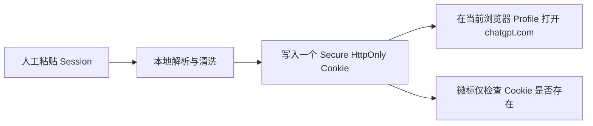

# Browser 充值公开项目复现与上号器设计评审

> 结论先行：公开项目可以提供实现线索，但不能替代本项目自己的菲律宾链路实验。诺汇盛上号器作为“人工把单个 Session Cookie 写入当前浏览器”的小工具，设计基本合理；作为每天数百单的 Browser Worker 登录适配器则不完整，不能原样进入批量执行链。

## 证据等级

后续讨论不再使用“官方是否披露风控”作为主要参照物，证据按以下顺序使用：

| 等级 | 证据 | 可以支持的结论 |
| --- | --- | --- |
| A | 本项目可重复的离线或非付款实验 | 可以冻结实现或排除假设 |
| B | 固定 commit 的公开源码和测试 | 可以形成候选设计，仍需本项目复现 |
| C | README、issue、X 帖子和作者自述 | 只能生成实验假设 |
| D | Playwright、Stripe 等底层文档 | 只解释浏览器/支付状态语义，不推断 OpenAI 风控 |

OpenAI 未公开的风控规则只能通过受控 A/B 实验归纳，不能从底层文档反推出内部判定条件。

## 已检查项目

| 项目 | 固定提交 | 主要价值 | 本轮结果 | 采用方式 |
| --- | --- | --- | --- | --- |
| [alexan0618/zkky](https://github.com/alexan0618/zkky) | `153c4ba159b0923d97ba84753305783f408150aa` | Checkout/绑卡/支付/最终状态拆分、歧义写请求不重放 | 50 个离线测试中 49 通过、1 失败 | 只借鉴状态合同和测试方法，不采用双代理/指纹默认值 |
| [tiantianGPU/reg-factory](https://github.com/tiantianGPU/reg-factory) | `94d45b0802ca1de9d9bfd6a2c2a5f955dde2de04` | 把 zkky 固定版本集成到批处理工作台 | 静态语法通过；集成版本相对上游存在大量本地改动 | 观察批次 UI、内存卡数据和并发调度，不作为上游等价物 |
| [VCnoC/plus-papay](https://github.com/VCnoC/plus-papay) | `8495eb88b4d5ffe13caea137c4092fcdabbaa23e` | 子进程隔离、资产锁、运行状态推送 | JavaScript 静态语法通过 | 只借鉴进程隔离；拒绝明文卡库和宽泛自动重试 |
| [lane2077/Gpt-Agreement-Payment](https://github.com/lane2077/Gpt-Agreement-Payment) | `1b8c1582551b3578aa94bfd1ffd4a6663fae1c51` | 3DS/challenge 状态和本地回放思路 | Python 静态编译通过；两种离线模式均因仓库缺少声明依赖的 `flows` 工件而无法运行 | 只作为状态词典与 mock 设计参考，不能宣称已复现 |

### 可重复命令与结果

```bash
# zkky
python3 -m unittest discover -s tests -v
# Ran 50 tests: 49 passed, 1 failed
# failure: standalone_config.json 的 fast_verify=true，测试要求默认 false

# 上号器解析器与权限边界
node --input-type=module -e "import assert from 'node:assert/strict'; import fs from 'node:fs'; import {parseSessionInput} from '/Users/lemon/Downloads/诺汇盛专用上号器 v1.1.0/token.mjs'; const v='abcdefghijklmnopqrstuvwxyz123456'; assert.equal(parseSessionInput(v).name,'__Secure-next-auth.session-token'); assert.equal(parseSessionInput(v,'__Secure-authjs.session-token').name,'__Secure-authjs.session-token'); assert.equal(parseSessionInput('__Secure-authjs.session-token='+v).name,'__Secure-authjs.session-token'); assert.equal(parseSessionInput(JSON.stringify({sessionToken:v})).value,v); assert.throws(()=>parseSessionInput('Bearer '+v)); assert.throws(()=>parseSessionInput('sk-'+v)); assert.throws(()=>parseSessionInput('unknown-cookie='+v)); assert.throws(()=>parseSessionInput('short')); const m=JSON.parse(fs.readFileSync('/Users/lemon/Downloads/诺汇盛专用上号器 v1.1.0/manifest.json','utf8')); assert.deepEqual(m.permissions,['cookies']); assert.deepEqual(m.host_permissions,['https://chatgpt.com/*','https://*.chatgpt.com/*']); console.log('session-loader-offline-tests: passed')"
# session-loader-offline-tests: 10 passed

# plus-papay 与 Python 项目静态语法
find plus-papay -name '*.js' -type f -print0 | xargs -0 -n1 node --check
python3 -m compileall -q zkky reg-factory/vendor/chatgpt_plus Gpt-Agreement-Payment/CTF-pay
# passed
```

`Gpt-Agreement-Payment` 的 README 声称支持纯离线和本地 mock，但实际还需要仓库中不存在的根目录 `flows`。补装 `requests` 与 `mitmproxy` 后仍无法启动，因此本轮结果是“不可按公开仓库独立复现”，不是“支付逻辑失败”。

## 从项目中保留的灵感

### 状态机优先于页面脚本

`zkky` 最有价值的不是协议字段，而是以下合同：

- HTTP 200 但 `requires_action` 不能判成功；
- 付款变更请求发出后连接断开，结果必须标为不可重放；
- 绑卡可见性和订阅激活允许只读轮询；
- 最终账号套餐状态是独立验证步骤。

这些合同与本项目资金栅栏一致，可以转化为本项目 fixture 测试。

### 批量执行需要批次屏障和每单隔离

公开项目普遍把并发当作“同时启动 N 个流程”。本项目应采用更严格的分层并发：预检可并发、Checkout observation 可受限并发、付款 Permit 独立串行或小并发。每单 Profile、代理 lease、卡片 lease 和资金 Permit 不能共享。

### 公开项目的指纹与代理结论只能成为实验变量

`zkky` 默认给账号分配固定 US 指纹并把提链与绑卡/支付拆成不同代理角色；`reg-factory` 又对出口继承做了本地调整。这证明公开实践本身并不一致。对于本项目，应先比较：

1. 同一菲律宾 sticky 出口贯穿整单；
2. 仅在 Checkout observation 前重新建立菲律宾运行；
3. Session 材料与浏览器 Profile 是否必须一起迁移。

任何方案都不能在付款后自动换出口重试。

## 诺汇盛上号器评审

样本路径：`/Users/lemon/Downloads/诺汇盛专用上号器 v1.1.0/`

### 它实际做了什么



Manifest V3 只申请 `cookies` 权限和 `chatgpt.com` host 权限；源码没有远程上传、扩展存储或后台服务。它支持 `__Secure-next-auth.session-token` 和 `__Secure-authjs.session-token`，写入 `Secure`、`HttpOnly`、`SameSite=Lax`、`.chatgpt.com`、`Path=/` 的会话 Cookie。

### 合理之处

- 权限窄，没有申请全站访问、剪贴板或远程服务权限；
- Token 不写入 extension storage，成功后清空输入框并关闭 popup；
- 拒绝明显的 API Key/Bearer 输入；
- 同时兼容 NextAuth 与 Auth.js 两种 Cookie 名；
- 只写一个 Session Cookie，减少把原账号出口绑定的临时 Cookie 全量搬到菲律宾环境的可能性。

最后一点是基于实现的合理推断，不是作者说明，也不是已验证的风控结论。

### 不足与误判点

| 问题 | 影响 | Browser Worker 要求 |
| --- | --- | --- |
| “已有会话”徽标只检查 Cookie 存在 | 过期、撤销、错误 Cookie 仍会显示已有会话 | 必须由独立网络探针验证账号身份、Free 状态和 account id |
| 写新 Cookie 前不删除另一种 Session Cookie | 两种 Cookie 可能同时存在，服务器采用哪一个不可控 | 注入前清理两种受支持 Session Cookie，证据中记录最终 Cookie 名集合 |
| 原始 Token 的 auto 模式默认写成 next-auth | 无名称的 authjs Token 无法自动推断 | Session 输入合同必须显式携带 cookie name，不能猜 |
| 复用当前人工浏览器 Profile | 旧账号 Cookie、localStorage、IndexedDB、Service Worker 和设备状态可能串号 | 每单独立、可销毁/可封存 Profile |
| 只注入 Session Cookie | 可能缺少 device 或其他必要材料，也可能恰好是更干净的方案 | 与 `CURATED`、`FULL_EXPORT` 做受控 A/B，不能先验判断 |
| 不验证预期账号 | Session 串号会在后面才暴露 | 注入后比较预期账号指纹化标识，禁止记录完整邮箱/Token |
| 没有退出与清理流程 | 人工连续上号可能残留旧状态 | 每次运行创建新 Context；失败后封存证据并销毁敏感材料 |

### 最终判断

它的设计对“人工、单账号、临时上号”是合理的，且比把整包 Cookie 直接导入当前日常浏览器更克制。它不是伪造登录证据或规避风控的完整工具；真正的误区是把“Cookie 已写入”和“页面看起来已登录”当成服务器认可登录。

本项目应复用它的输入解析规则与最小权限思想，不安装扩展、不复用人工 Profile，也不复用它的 Cookie 存在徽标作为成功证据。

## 下一轮非付款测试

按以下顺序执行，不一次混合变量：

1. `SESSION_LOADER_SINGLE_COOKIE`：模拟当前上号器，但在干净 Profile 中注入，并删除冲突 Cookie；
2. `SESSION_LOADER_CURATED`：增加 device/必要 Cookie，排除 Cloudflare 临时和陈旧路由状态；
3. `SESSION_LOADER_FULL_EXPORT`：完整材料对照；
4. 三组都使用同一非菲律宾 Free 测试账号、同一菲律宾 sticky proxy、同一浏览器版本；
5. 用真实 BrowserContext 之外的独立网络探针核对 Session 身份，页面 UI 只作辅助证据；
6. 登录结论稳定后，才测试 `UI_ENTRY` 与页面内 hosted Checkout discovery，并停在卡片输入之前。

公开项目下一轮优先级：先移植 `zkky` 的非重放状态 fixture，再比较 ABCard 风格 headed Chrome/CDP 与本项目 Playwright；`plus-papay` 和 `Gpt-Agreement-Payment` 不作为可运行底座。

## X 调研结论

已用中英文组合搜索 ChatGPT Plus、代充、Checkout、Playwright、自动化和候选仓库名。当前可检索结果主要是教程、导流和二次转述，没有找到包含固定 commit、可复现日志或测试代码的近期 X 技术帖。因此 X 继续作为项目发现入口，不作为设计证据；找到仓库后仍回到源码、提交和本项目实验验证。
