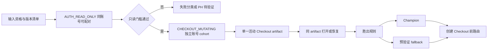

# Browser 多赛道架构第一轮对抗式审查报告（2026-08-22）

> 结论：多赛道方向正确，但现有实验合同存在五项必须先修正的 P0 问题。最关键的不是“哪条赛道更像真人”，而是实验污染、账号级并发、Checkout 工件泄露、切赛道边界和付款动作边界。本文已把修订同步到 Browser 基线、实验合同、决策账本、实施计划和路线图。
>
> 范围：架构、离线代码和文档审查；没有使用真实 Session、没有连接菲律宾代理、没有创建真实 Checkout、没有填写卡片、没有提交付款。

## 1. 审查方法和证据边界

本轮用以下反例检验当前设计：Worker 在每个检查点崩溃；同一账号被两个订单同时提交；五条赛道依次创建 Checkout；hosted URL 泄露；源 Profile 含其他网站资料；代理在阶段间漂移；人工接管与自动 Worker 同时动作；付款页显示成功但权益或取消状态延迟；非菲律宾预筛错误淘汰地区相关方案；350 单仿真只证明浏览器 CPU 足够而掩盖外部瓶颈。

审查依据是当前项目事实源、`browser-poc/checkout-link-core.js` 的恢复合同和已固定提交的公开源码调研。公开项目只用于构造反例，不视为本项目线上事实。

## 2. 必须先修正的 P0 问题

| ID | 反例 | 当前风险 | 强制修订 | 验证方式 |
| --- | --- | --- | --- | --- |
| AR-P0-01 | 同一 Session 依次跑五条会创建 Checkout 的赛道 | 前一条赛道已经改变账号、Session、Checkout 和风控状态，后跑结果不可比较 | 把实验拆成只读阶段和 Checkout 变更阶段；只读阶段可同账号配对，变更阶段使用隔离账号 cohort，并对 lane、顺序和 Session 年龄做平衡 | runner 拒绝同一账号在同一实验窗口进入第二条 `CHECKOUT_MUTATING` 赛道；报告展示每条 lane 的独立分母 |
| AR-P0-02 | 同一 ChatGPT 账号用不同 CDK/订单并发进入 Browser | 订单级资金栅栏挡不住跨订单的同账号重复购买 | 在付款许可前增加账号身份 HMAC 的持久化互斥；账号、订单、卡片、Checkout artifact 四类资源均受租约约束 | 并发测试证明两个订单只能有一个账号级活动 run，失租约者停止动作 |
| AR-P0-03 | Checkout 过期后仅凭时间自动重建 | 旧 Checkout 是否仍活跃未知，可能制造多个可付款工件并诱发换路线重提 | 过期只进入 `CHECKOUT_REVIEW_REQUIRED`；只有确定性失效证据和同一 attempt 的受控恢复授权才允许重建 | 单测覆盖过期、重复打开、崩溃和旧链接迟到；默认 `mayCreateCheckout=false` |
| AR-P0-04 | hosted 长链进入数据库、日志、截图、HAR 或后台页面 | 链接可能包含可直接打开支付页的完整 authority，哈希 Checkout ID 不等于保护完整 URL | 原始 URL 只进入加密短期 artifact vault；数据库只存 opaque ref、哈希、种类、创建/打开/失效时间；人工接管使用一次性代理入口 | secret-scanner 和序列化测试证明 URL fragment、Checkout ID 不出现在普通持久化和证据中 |
| AR-P0-05 | hosted 失败后切 same-context、再新建 Checkout；或人工接管与 Worker 同时提交 | 切赛道可能绕过唯一付款机会；UI 点击不是唯一可能提交支付的动作 | Checkout 创建后只允许围绕同一 artifact 恢复；付款可能提交后只能对账。付款提交许可覆盖 click、Enter、form submit、wallet 和 3DS 确认，接管先原子转移控制租约 | 故障注入证明任何控制者、任何提交动作最多消费一次 permit；不确定时不能换 lane、换卡或新建 Checkout |

## 3. P1 架构问题

| ID | 问题 | 影响 | 处理结论 |
| --- | --- | --- | --- |
| AR-P1-01 | `FULL_PROFILE_STATE` 容易被理解为复制整个人浏览器 Profile | 可能带入密码、支付方式、其他站点 Cookie、扩展和原地区残留 | 改名 `CHATGPT_SITE_STATE_CLONE`；只读来源、工作副本、域名 allowlist、字段清单和销毁证明，禁止直接驱动源 Profile |
| AR-P1-02 | “同 sticky session”没有证明每阶段实际出口未漂移 | 创建、打开、3DS、回跳可能落在不同 ASN/IP/城市 | 每阶段记录出口证明和 lease 哈希；漂移即 `INCOMPARABLE`，不是 lane 失败 |
| AR-P1-03 | Session 会随实验顺序老化 | 后跑 lane 可能因 Session 年龄而变差 | 记录精确年龄和比较窗口；使用随机化、平衡顺序或独立 cohort，不做固定 A→B→C→D |
| AR-P1-04 | 非菲律宾功能失败可淘汰，成功率低却不一定能淘汰 | 地区相关行为可能让非 PH 结论反转 | 非 PH 只能淘汰地区无关的代码/合同错误；地域相关失败保持 `DEFERRED_PH_REQUIRED` |
| AR-P1-05 | 单一“成功率”会被有效 Session 过滤和隐形重试美化 | 无法判断批量真实产能 | 同时报端到端、输入合格率、各阶段条件成功率、挑战率、人工率、未知率和每单 Checkout 创建数；所有尝试进入分母 |
| AR-P1-06 | “胜出一个 adapter”过于绝对 | 不同账号来源、Session 材料或页面形态可能需要不同主路径 | 允许一个 champion 加一个已独立验证的 fallback；只能在创建 Checkout 前按资格路由，不能在不确定 run 内自动切换 |
| AR-P1-07 | 只验证页面可达和非付款 Checkout 不足以证明交付 | 扣款、权益、回跳、取消、授权撤销可能分离 | 后续真实阶段分别验收提交、卡交易、权益、取消和延迟撤销；页面文字不作为单一成功证据 |
| AR-P1-08 | 人工接管只描述 UI，未冻结所有权转移协议 | Worker 与人工可同时输入，旧控制者可能失租约后继续动作 | 接管采用 `REQUESTED→FROZEN→TRANSFERRED→RELEASED`；控制权和 permit 消费由控制面约束，不靠按钮置灰 |
| AR-P1-09 | AI/语义定位可能读取账号和支付 DOM | 敏感数据可能离开 Worker 信任边界，且不可复现 | 外部模型只允许处理合成或强脱敏观察；真实支付页的最终定位和状态迁移必须本地、版本化、确定性 |
| AR-P1-10 | Patchright/Camoufox 等 runtime 作为实验轴但未冻结供应链要求 | fork 滞后、行为差异或依赖污染会被误归因于 lane | 固定 commit/包哈希、浏览器版本、镜像摘要和 SBOM；未审查 runtime 不接真实凭据 |
| AR-P1-11 | 350 单/24h 只按浏览器平均并发估算 | 真瓶颈可能是 Session 有效率、代理、卡拒绝、3DS 或人工队列 | 容量仿真加入突发流量、挑战率、人工 SLA、代理容量、卡库存和对账积压；分别报自动与人工容量 |
| AR-P1-12 | Checkout 创建被视为无资金动作，缺少变更预算 | 大量无付款创建仍可能污染账号、触发限流或产生长期工件 | 增加账号级 Checkout 创建配额、冷却时间、活动 artifact 上限和实验 kill switch |
| AR-P1-13 | 运行证据缺少完整版本清单 | 相同 lane 名称可能实际运行不同浏览器、页面策略或代理配置 | 每轮冻结代码 commit、runtime/browser/OS 镜像、locale/timezone、Session policy、网络 lease 和 adapter 版本 |
| AR-P1-14 | 成功终态没有区分即时交付与延迟资金变化 | 授权后撤销或延迟交易可能在客户成功之后出现 | 客户交付仍以权益+取消确认为准；另建不触发自动重付的 post-settlement 观察和人工案件 |

## 4. P2 质量问题

- 产品、金额、税费、续费周期和币种解析必须覆盖本地化格式，不能只匹配英文或固定 PHP 字符串。
- 同一代理出口不等于同一浏览器网络身份；TLS、HTTP/2、DNS、WebRTC 和系统时区差异需要作为 runtime 证据，而不是伪装成 lane 效果。
- 重复刷新和重新打开 hosted 页面都应计数；“最后一次打开成功”不能覆盖之前失败。
- 测试 fixture 只保留合成响应结构，不能把真实 Session、完整 HAR、hosted fragment 或卡片数据复制进仓库。
- 失败赛道归档需要保存最小复现、版本、适用范围和淘汰层级，防止后续模型把非 PH 失败误写成 PH 淘汰。

## 5. 修订后的实验结构

实验不再追求“用一个账号公平跑完所有赛道”。正确的可比方式是：只读实验用配对设计；会改变账号状态的实验用独立 cohort，并报告账号来源、Session 年龄、网络等级和顺序分布。

## 6. 本轮已执行的修订

1. 新增 `contracts/2026-08-22_browser-multi-lane-experiment-contract.md`，冻结实验单位、变更预算、资源租约、工件保密、路由和成功证据。
2. 修订多赛道基线和 lanes 入口，取消“同一 Session 顺序创建多个 Checkout”的强制条件。
3. 修订 Browser 主基线：账号级锁、Checkout artifact vault、站点状态克隆、人工接管所有权、容量真实瓶颈和 post-settlement 观察。
4. 修订 `checkout-link-core.js`：Checkout 过期不再仅凭时间允许重建。
5. 在 `DECISIONS.md` 增加 D-054 至 D-057，并同步实施计划、路线图和 Agent 入口。

## 7. 下一可执行项

在没有菲律宾 sticky 输入时，下一步应实现离线实验编排器和 mock gateway：验证实验作用域、账号/Checkout 租约、artifact 序列化脱敏、接管所有权转移、过期 Checkout 审查和 champion/fallback 的预路由。菲律宾真实 A/B 等输入具备后再执行，且不在同一账号上串行创建五个 Checkout。
