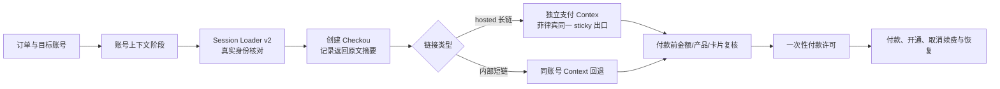

# Browser Checkout 提链研究报告（2026-08-22）

> 结论：提链值得升级为 Browser 主链路的首选候选方案，但当前只能确认“架构上更适合批量”，不能确认“已比原上号器成功率更高”。第一轮对抗式审查已纠正原“同账号顺序创建多个 Checkout”的实验污染：菲律宾 sticky 下先做同账号只读配对，再用隔离账号 cohort 比较会创建 Checkout 的赛道。
>
> 范围：只做公开源码静态分析、离线测试和本项目接口设计；没有使用真实 Session、没有连接菲律宾代理、没有创建真实 Checkout、没有提交付款。报告完成后已在 `browser-poc/checkout-link-core.js` 落地纯离线链接分类与恢复合同。

## 1. 本报告中的“提链”

用户提到的“提炼”按同行语境暂解释为“提链”：先在目标账号的有效登录上下文中创建 Checkout，再提取可导航的结账链接。若用户原意不是“提链”，本结论需要重新确认。

公开实现混用了两类链接，必须分开建模：

| 类型 | 典型形式 | 对 ChatGPT Session 的依赖 | 本项目定位 |
| --- | --- | --- | --- |
| 内部短链 | `https://chatgpt.com/checkout/{entity}/{session_id}` | 高；打开和后续流程可能仍依赖当前账号上下文 | 兼容回退，不作为跨 Context 解耦证据 |
| Hosted 长链 | `https://pay.openai.com/c/pay/{session_id}#{fragment}` | 有机会独立于 ChatGPT Cookie，但有效期、回跳和最终开通仍需实测 | 首选实验对象 |

生成链接不等于以下任何一项已经成立：

- 链接能在另一个 BrowserContext 打开；
- 产品、币种、金额和处理主体正确；
- 卡付款能够提交；
- 付款后 Plus 能正确开通；
- 回跳/finalize 正常；
- 链接未过期、未消费且可恢复。

## 2. 公开源码证据

### 2.1 `plus-extractor`

- 固定提交：[`451aff99db33663a6e156ce8974b5030fd35896d`](https://github.com/shi-YangYang/plus-extractor/tree/451aff99db33663a6e156ce8974b5030fd35896d)
- 观察：实现了 Checkout 创建与同一 session 的 update 两阶段流程，优先识别 `oaics_*`，并把链接提取作为独立批处理阶段。
- 局限：其当前主路径是 US→TR 代理和 PH/PHP 优惠 Checkout，目标、促销和地域路径与本项目“菲律宾出口下正常 Plus 卡付款”不相同；只能借鉴分阶段、同 session 更新、隔离进程和证据结构，不能照搬参数。
- 离线结果：其 checkout helper 47/47 测试通过；这些是 mock/合同测试，不证明线上可用。

### 2.2 `chatgpt-specimen-toolbox`

- 固定提交：[`f0601b9ef7b39edfe54c3a6baf25c7d7233e2ba2`](https://github.com/1837620622/chatgpt-specimen-toolbox/tree/f0601b9ef7b39edfe54c3a6baf25c7d7233e2ba2)
- 观察：采用三步长链法：创建 Checkout、调用 Stripe `payment_pages/{session}/init` 取得 hosted URL、再规范化为 `pay.openai.com` 链接；同时保留内部短链。
- 重要反证：同一份源码同时记录 hosted 链接可独立打开，以及旧 hosted/PayPal 回跳后 finalize 异常的经验。它证明“链接可打开”和“订阅闭环成功”是两个独立验收点。
- 安全观察：新版本明确只把自定义 token 留在内存并清除历史 localStorage 残留；这是可借鉴的敏感数据原则。源码仍含自有 Stripe 代理兜底，不适合直接引入本项目。
- 离线结果：JavaScript 语法检查通过；导出格式 8 项检查通过，另一个上游对照因未提供外部 HTML 而跳过。

### 2.3 `chatgpt-checkout-link-gui`

- 固定提交：[`0ecb812c5f14640eae2cdc7e9cec698d74480c14`](https://github.com/ciaooo55/chatgpt-checkout-link-gui/tree/0ecb812c5f14640eae2cdc7e9cec698d74480c14)
- 观察：直接使用 access token 创建 hosted Checkout；响应没有完整 URL 时，再用 Checkout session id 和 publishable key 初始化 Stripe hosted 页面；最后才回退内部短链。
- 局限：单文件 GUI 没有订单租约、账号身份绑定、批量隔离、支付未知恢复和完整审计；优惠确认也有“请求了但未权威确认”的状态。适合作为协议形态参考，不适合作为生产执行器。
- 离线结果：Python 编译检查通过；仓库根目录未发现许可证，不复制源码。

### 2.4 `gpt-pp`

- 固定提交：[`c5c72f541ea853eb60d490687326ed5a3f29cc37`](https://github.com/jmmy9609-design/gpt-pp/tree/c5c72f541ea853eb60d490687326ed5a3f29cc37)
- 观察：把 hosted Checkout、Stripe init、PayPal authorize 和金额 gate 拆开，且同 token 的 Checkout 尝试串行化；证明“账号侧提链→支付侧动作”可以做成有状态流水线。
- 局限：主要目标是零金额 PayPal 授权，不是本项目的菲律宾卡支付；不能把其金额、代理矩阵或确认策略迁入本项目。
- 离线结果：57 项测试中 50 项通过，2 项失败、5 项错误；本机缺少 `curl_cffi`，相关测试在代理/session 构建前中断，因此不能算完整通过，也没有为调研安装并运行其网络依赖。

## 3. 推荐架构

提链不替代 Session Loader，而是把原来一个长 Browser 流程拆成两个可分别验证的阶段：

推荐的候选模式为 `CHECKOUT_LINK_HOSTED_V1`：

1. 账号 Context 只负责加载 Session、核对账号、确认 Free 状态和创建 Checkout。
2. 优先保存服务端或 Stripe init 返回的完整 hosted URL；不凭 session id 猜 fragment。
3. 支付 Context 仍使用同一订单的菲律宾 sticky 出口；首轮实验不同时改变 IP、浏览器内核、locale 和 Cookie policy。
4. hosted 长链不能打开时，只允许围绕同一个 Checkout artifact 使用已批准的 same-context 打开方式；不能仅凭过期、打不开或页面漂移自动新建 Checkout。
5. 付款后账号开通与取消续费仍回到账号 Context 做真实核验；支付页成功文字只是一项证据。

## 4. 它是否比原上号器更好

答案分两层：

- 对批量执行架构：更好。它把短命、敏感的账号登录上下文与更重的支付页面自动化隔离，能够独立限流、超时、重建支付 Context，并为每单保留 Checkout identity 和恢复检查点。
- 对当前线上成功率：尚未证明。原上号器在人工单账号、真实 Chrome 现有 Profile 中更简单，可能暂时拥有更好的兼容性；Session Loader v2 和 hosted 提链必须经过同条件 A/B 才能声称更稳。

当前方案仍有以下问题：

| 问题 | 后果 | 验证/控制 |
| --- | --- | --- |
| hosted URL 可能过期、单次消费或与创建上下文相关 | 重开页面失败或产生新 Checkout 诱惑 | 记录创建时间、首次打开、session id 哈希；禁止盲目重建 |
| 内部短链仍需原账号 Session | 所谓解耦失效 | 链接种类显式字段，不把短链计为 hosted 成功 |
| 跨 Context 打开可能改变风控输入 | 创建成功但支付页异常 | 首轮保持同一菲律宾 sticky 出口和相同环境，只改变 Cookie 隔离 |
| processor/entity、PHP 金额或税费发生漂移 | 错主体、错金额付款 | 每次付款前从实际 Checkout 重读，不信配置默认值 |
| 页面可打开但 finalize/Plus 开通失败 | 已扣款但未交付 | 付款页、卡交易、账号 entitlement 三方对账；进入未知锁定 |
| Session Loader v2 过严或临时 Context 丢失必要材料 | 假阴性、登录成功率下降 | 与原上号器真实 Chrome 控制组并列 A/B，不提前淘汰原方案 |

## 5. 非付款 A/B 验收

实验拆成两个阶段，避免前一组创建 Checkout 后污染后一组：

- 只读配对：同一账号、同一菲律宾 sticky 出口、平衡顺序比较 Session 装载、服务器身份、Free 状态和升级入口，禁止创建 Checkout；
- Checkout 变更 cohort：A–D 各使用隔离账号样本，账号来源、Session 年龄、网络 lease 和运行时分布保持可比，每个账号只进入一个变更组。

| 组 | 登录/提链方式 | Cookie policy | 要回答的问题 |
| --- | --- | --- | --- |
| A | 原诺汇盛上号器 + 干净真实 Chrome Profile | 原单 Cookie | 人工基准能否稳定识别真实账号并进入 Plus Checkout |
| B | Session Loader v2 + 页面内直接进入 Checkout | `SESSION_ONLY` | 最小材料是否足够 |
| C | Session Loader v2 + hosted 提链 | `CURATED` | hosted 能否在第二 Context、同出口打开并保持产品/金额 |
| D | Session Loader v2 + hosted 提链 | `FULL_EXPORT` | 补全 Cookie/device 材料是否改善结果 |

每组至少记录：

- Session 取得国家/时间、账号常用国家（若可知）和测试时间；
- 菲律宾实际出口 IP 哈希、ASN/城市、sticky session id 哈希；
- Browser/Loader/Checkout adapter 版本；
- 服务器返回身份类型与哈希、Free/Plus 状态；
- Checkout link kind、Checkout session id 哈希、processor entity；
- 产品、PHP 金额、税费、可见支付方式；
- 同 Context 可打开、第二 Context 可打开、刷新后可打开；
- 是否出现验证码、重新登录、挑战、地区不可用或页面漂移。
- scope、cohort、attempt 序号、每账号 Checkout 创建数和 runtime manifest；
- 账号、Checkout 创建、第二 Context 打开等各阶段的出口证明；
- 原始 hosted URL 只进入加密短期 artifact vault，报告只存 opaque ref 和哈希。

本轮非付款实验的通过条件是 C/D 中至少一组能重复产生并在第二 Context 打开同一 hosted Checkout，且账号、产品、PHP 金额和处理主体一致。它仍不等于真实付款闭环通过。

## 6. 与现有后台的可调边界

Browser 跑通优先于保持现有表名、Provider 抽象和许可名称不变。以下可以调整：

- `fulfillment_routes` 是否继续同时承载卡片来源和执行器；
- `executor_profiles`、`browser_runs` 和 Checkout artifact 的具体表结构；
- `CHECKOUT_OBSERVATION_PERMIT` 是否保留为独立名称，或改成更简单的 `checkout_create_grant`；
- Browser 是作为一种 Provider、Executor，还是拆为账号阶段和支付阶段两个 adapter；
- 后台页面、派发批次、并发配额和人工接管的现有布局。

只有三项硬不变量不能因提链而删除：

1. 一个订单不能产生两次真实扣款。
2. 付款结果不明确时不能自动再付，必须先对账。
3. 订单、账号、Checkout、卡片、扣款、Plus 开通和取消续费必须能串成一条审计链。

当前建议是保留一个轻量的 Checkout 创建授权，但不把它包装成资金许可：创建 Checkout 不等于付款，却是会污染账号状态的外部变更，必须受账号级预算、活动 artifact 上限和审计约束。真正的资金边界覆盖所有可能提交支付的动作，而不只覆盖鼠标点击；具体命名和表结构可以随 Browser PoC 调整。

## 7. 下一步

1. 已完成：`browser-poc/checkout-link-core.js` 增加 `HOSTED_LINK_READY`、`SAME_CONTEXT_FALLBACK`、`HOSTED_LINK_INCOMPLETE` 分类，不保存原始 session id；付款可能已提交后只允许 `RECONCILE_ONLY`。
2. 已完成：本地模拟完整 hosted URL、内部短链、缺片段、过期、重复打开和付款未知场景；Browser PoC 专项 26/26、legacy 全套 34/34 通过。
3. 输入准备后执行同账号只读配对和 A–D 隔离账号 cohort；未得到真实 Session 和 sticky 出口前保持 `BLOCKED_INPUT`，不伪造通过。
4. 根据 A/B 结果决定 champion，以及是否存在一个可在 Checkout 创建前按账号特征路由的预验证 fallback。
5. 只有主路径被冻结后，再最小修改运营后台表结构和派发页面。
