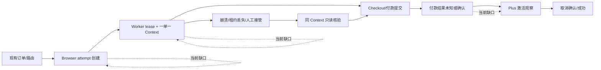

# Browser 自动化充值控制面：对抗式审查报告

日期：2026-08-22
审查对象：Browser 自动化充值执行器及其与现有订单、Provider 路线、资金栅栏、审计、异常恢复的接口
审查性质：实现前置闸门审查；不接生产、不使用真实账户、卡片、Session、Checkout 或付款

## 结论先行

当前方向没有根本性错误。把 Browser 充值放在现有订单、Provider 路线、资金栅栏和审计之下，并用 MySQL 确定性状态机决定“是否允许外部付款动作”，是正确的控制面方向。

但是，当前成果还不能证明“可以开始批量 Worker 运行”，更不能证明“每天几百单”或“菲律宾固定出口可稳定运行”。本轮审查发现四个必须先过的闸门：

1. Browser attempt 创建和 Worker dispatch 还没有接入现有通用入口；现有 `beginAttempt` 仍要求 Provider account，并写入 `provider_calls`，与 Browser route 的 `recharge_provider_account_id = NULL` 不相容。
2. 付款确认后，Plus 激活和取消确认尚未进入 Browser 控制面状态机；`PAYMENT_CONFIRMED` 不能直接当作 `RECHARGE_SUCCESS`。
3. 现有 350 单容量测试是串行、合成网关、等价负载，不是并发队列、长租约和 24 小时 soak 证据。
4. 真实 BrowserContext、菲律宾 sticky exit、目标账户 Session 和 Checkout 尚未实现/验证；“一单一 Context”目前是设计契约，不是实际运行证据。

另外有若干 P1 操作风险，尤其是管理员可以把尚未发生外部付款的 `NOT_STARTED`/`PAYMENT_ARMED` 运行标为 `PAYMENT_UNKNOWN`。这不会造成重复付款，但会把本来可安全释放的订单错误地锁进人工对账。

## 审查边界与证据

- 事实源：`CLAUDE.md`、Browser 基线、当前状态、最终实施计划、`DECISIONS.md`、`v1/` 控制面代码和测试。
- 本轮未访问生产、未开卡、未填真实卡片、未取得真实 Session、未创建真实 Checkout、未点击付款。
- 已复核：Browser PoC 11 个测试文件、77 个测试全部通过；`git diff --check` 通过；关键 Browser repository/service 通过 `node --check`。
- 既有全量结果：v1 共 357 个测试，328 通过，29 个因未设置 `TEST_DATABASE_URL` 跳过，0 失败。
- MySQL 8.4 关键执行/恢复/admin 场景已通过，但尚未覆盖真正多连接并发竞争和长时运行。

## 风险路径

## 必须阻断后续 Worker/soak 的问题

| 编号 | 级别 | 发现 | 影响 | 闸门与修复 |
|---|---|---|---|---|
| AR2-P0-01 | P0 | 通用 `beginAttempt` 要求 `recharge_provider_account_id`/`provider_code`，并创建 `provider_calls.create_direct`；Browser route 没有 Provider account。 | Worker 无法从真实订单自然创建 Browser attempt，容易另造旁路业务系统，破坏现有订单/资金/审计链。 | 在现有 attempt 接口内增加明确的 Browser 分支或 Browser adapter；仍由订单和资金 attempt 拥有最终状态。完成前不接 Worker。 |
| AR2-P0-02 | P0 | Browser 控制面目前到 `PAYMENT_CONFIRMED` 为止，没有 Plus 激活、取消确认、延迟生效和最终成功的显式状态/证据。 | 可能把已扣款但未激活、未取消或状态延迟的订单误报成功。 | 增加 post-payment observer/checkpoint/state mapping；只有激活和取消证据齐全才进入成功。 |
| AR2-P0-03 | P0 | `run-capacity-simulation.js` 为串行循环，使用 synthetic gateway；没有并发队列、backlog、6–12 Worker、长租约 heartbeat 或 24h soak。 | 不能推导吞吐、租约安全、数据库锁竞争、人工 SLA 或“几百单/天”。 | 先完成多进程/多连接并发测试、可观测队列、租约续租和 24h soak；容量结论只能标为未验证。 |
| AR2-P0-04 | P0 | 真实 BrowserContext、Session loader、Checkout 页面和菲律宾 sticky exit 尚未接入；当前页面是 mock runtime。 | 一单一 Context、地区分层、真实页面 locator、网络和登录态风险均未被验证。 | 冻结 runtime/profile/region manifest；在沙盒候选账户上完成真实页面回放和证据采集，仍禁止真实付款。 |

## 高优先级控制面问题

| 编号 | 级别 | 发现 | 影响 | 建议 |
|---|---|---|---|---|
| AR2-P1-01 | P1 | Admin `MARK_PAYMENT_UNKNOWN` 允许 `NOT_STARTED`、`PAYMENT_ARMED`。 | 未发生外部付款也会被错误标为未知，造成无谓人工对账和订单冻结。 | 仅允许 `PAYMENT_SUBMITTING`，或存在已提交且结果未知的 `PAYMENT_SUBMIT` operation；前置状态用 `RELEASE_SAFE`/`CANCEL`。 |
| AR2-P1-02 | P1 | `accountKeyHmac` 的规范化输入、版本、Session identity 来源和变更策略尚未落成耐久契约。 | 同一账户可能被拆成多个并发租约，或不同账户被错误合并。 | 固化 versioned canonical identity（优先稳定 account id，email 仅作观测）；记录 identity version 和变更审计。 |
| AR2-P1-03 | P1 | Vault 支持 key ring 解密，但没有在线重加密 runner、过期 artifact cleanup runner 和容量告警。 | 长期运行后密文/元数据膨胀，轮换和恢复窗口不可控。 | 增加 rotation/cleanup 作业、保留期、失败重试和审计指标。 |
| AR2-P1-04 | P1 | MySQL 测试主要是顺序场景；尚无真正多连接的 lease takeover、admin control、duplicate permit 竞争测试。 | 单元/顺序测试通过不代表并发下不会双 worker 或双控制动作。 | 用独立连接和 `Promise.all` 覆盖 acquire/heartbeat/recover/commit/admin race，并断言唯一外部动作。 |
| AR2-P1-05 | P1 | 实际 Worker 尚不存在；数据库拒绝旧 lease 还不等于旧 Browser page 不会继续点击。 | 进程失联、网络分区或租约过期时，旧页面可能继续执行。 | Worker 必须有 action watchdog：每个导航/点击前检查 lease epoch、control mode 和 payment permit；失联立即停止页面动作。 |
| AR2-P1-06 | P1 | executor profile 仍缺少不可变 browser/runtime/image/SBOM hash gate。 | 浏览器或依赖漂移会改变 locator、指纹和支付行为，问题无法复现。 | 将 runtime manifest、镜像 digest、浏览器版本和依赖 SBOM 绑定到 run，并在 Worker 启动时拒绝漂移。 |
| AR2-P1-07 | P1 | kill switch、Checkout 创建额度、账户冷却/日配额等运行闸门还未形成可验证的 MySQL 约束。 | 高峰或异常时无法快速停止新 Checkout，资金和风控暴露面扩大。 | 将全局/route/account/card 级开关、quota、cooldown 作为 DB 可审计决策，并覆盖恢复路径。 |
| AR2-P1-08 | P1 | `RELEASE_SAFE` 依赖人工确认，但尚未要求同一 Context 的最后页面签名/只读快照证据。 | 人工可能基于过期 UI 释放，无法证明页面仍停在安全点。 | 释放前采集同 Context 只读签名、最近 checkpoint 和 permit 状态，证据与操作同事务落盘。 |
| AR2-P1-09 | P1 | 失败注入尚未覆盖每个关键 SQL 边界（permit 消费、unknown 转换、资源销毁、管理员控制）。 | 部分提交/超时可能留下难以恢复的中间态。 | 为每个事务边界加入故障注入和重放测试，验证幂等与补偿。 |

## 次优先级但不能遗忘的问题

- 菲律宾 sticky exit、目标账户所在国、币种/税费/账单地址的真实结果尚未测量，当前只能保留 `DEFERRED_PH_REQUIRED`，不能把“能连上”当作“风险可接受”。
- 运行指标、告警和 champion/fallback 选择尚未以队列、lane、unknown rate、人工处理时延、资金暴露额为核心建立。
- 现有 PoC 的“通过”证明状态机和恢复样例成立，不证明真实 DOM locator、页面等待、支付重定向或延迟结算成立。
- 旧的多 lane/实验报告中的账户级并发、Checkout 过期不等于失效、artifact 泄漏、切 lane 不得重付等 P0/P1 仍应作为本审查的回归清单，不能因控制面新增而视为自动关闭。

## 推荐的闸门顺序

1. 先修正并测试 Browser attempt/dispatch 接口，以及 post-payment 状态闭环。
2. 再做多连接并发、lease takeover、旧 Worker action watchdog 和 24h soak。
3. 同步冻结 runtime/profile/region manifest，接入真实但不付款的 BrowserContext/Session/Checkout 回放。
4. 通过以上闸门后，才讨论小规模人工批准的 sandbox 充值；在此前不讨论生产吞吐和风控结论。

## 审查判定

**方向判定：通过（控制面方向正确）。**
**实施判定：暂不通过（Worker/soak 前置闸门未满足）。**
**容量判定：未验证。**
**真实地区/风控判定：未验证，保留 DEFERRED_PH_REQUIRED。**

本报告不把“尚未实现”描述成“实现失败”，也不把 mock/等价负载测试升级为生产事实。下一次重大节点应根据本报告的 P0/P1 处理结果更新 Browser 基线、实施计划和 `DECISIONS.md`。

## 关于“客户账号因充值被封控的概率”

目前不能负责任地给出一个百分比。公开资料没有按“跨地区 Session + 菲律宾执行出口 + 批量 Plus 充值”这一组合公开分母、样本量或误报率；OpenAI 只公开说明，检测到疑似账号被入侵或可疑活动时可能临时暂停账号，付款无法完成时也可能降级或暂停访问。[可疑活动说明](https://help.openai.com/en/articles/10471992-why-am-i-receiving-a-suspicious-activity-alert)、[账号停用说明](https://help.openai.com/en/articles/10562188-why-was-my-openai-account-deactivated)、[使用条款](https://openai.com/policies/terms-of-use/)

因此当前项目应把封控概率记为 **未知且可能高度分层**，不能写成“低风险”或用公开帖子推导百分比。对单个客户账号，风险更可能由多个信号叠加决定，而不是由菲律宾 VPN 一个因素决定：

- 账号最近的登录国家/设备/Session 年龄与菲律宾执行出口是否出现突变；
- 同一账号是否在短时间内重复登录、反复创建 Checkout、失败后换 lane 或换卡；
- 支付主体、账单/币种、卡片复用、订阅取消和账号常用行为是否一致；
- 自动化运行是否出现页面漂移、验证码/3DS、未知支付结果后继续动作；
- 同一网络、设备状态或卡片是否横跨多个客户账号产生可关联的批量行为。

在没有真实、获批准的非付款/小规模 cohort 数据前，我们只做定性分层：

| 场景 | 当前判定 |
|---|---|
| 单账号、稳定 Session、固定执行出口、无异常重试、付款后完整观察 | 风险未知，不能承诺低 |
| 多账号共享运行环境、跨国家快速切换、短时间大量 Checkout | 高风险候选，禁止直接规模化 |
| 付款未知后自动重试、换卡或换 lane | 不可接受，属于资金和账号双重风险 |
| 页面/Session 证据不完整但仍继续付款 | 不可接受，必须停止并人工复核 |

最高原则应转化为可停止的统计闸门，而不是口号：按账号 cohort 记录 1 小时、24 小时、7 天和 30 天的可疑活动、临时限制、停用、付款争议和恢复结果；按执行 lane、出口、runtime、卡片族群和账号常用国家分层。没有这些分母，任何“封控率 0.x%”都不可信。

在数据达到可解释门槛前，建议采用零容忍的上线判定：出现一例无法解释的账号停用，立即冻结该 lane；出现同一 lane 两例相关事件，冻结该 lane 及其 runtime/profile 组合，转入人工审查。该阈值是运营保护阈值，不是对平台真实风控概率的估计。

### 非官方材料的交叉核对

本轮补查了公开社区案例、开发者社区和公开自动化项目线索。它们反复出现三类叙述：VPN/旅行或设备网络切换后出现 suspicious-activity 限制；付款成功后因账单/订阅状态不一致而被降级或停用；账号共享、自动化工具或批量行为被视为账号安全风险。社区中也有“未使用 VPN 仍被限制”的案例，说明这些材料不能证明单一因果关系。

这些材料的证据等级低于受控 cohort：有选择偏差、重复发帖、缺少完整日志和失败分母，且公开项目通常只展示成功路径，不展示被封控的运行量。因此它们适合用来发现风险假设，不适合计算概率。公开项目和帖子支持我们增加“跨账号关联、账单一致性、环境突变、自动化停止闸门”等观测字段，但没有改变“当前封控率未知”的结论。
