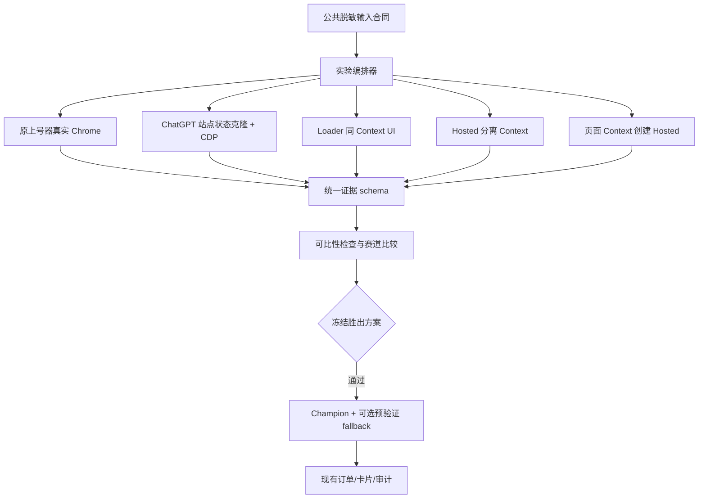

# Browser 多赛道 PoC 基线（2026-08-22）

> 决策：不再提前押注单一上号或 Checkout 方案。多个方向作为隔离赛道并行验证，共享同一证据和验收合同；胜出赛道才接入现有业务系统。
>
> 当前仍不接生产、不使用真实卡、不提交真实付款。
>
> 2026-08-22 第一轮对抗式审查修订：同一账号只适合做不创建 Checkout 的只读配对实验；任何会创建 Checkout 的赛道必须使用隔离账号 cohort。完整规则见 `contracts/2026-08-22_browser-multi-lane-experiment-contract.md`。

## 1. 为什么采用赛道制

当前未知变量至少包含 Session 材料、账号常用地区、菲律宾执行出口、Browser runtime、页面 UI、Checkout 创建方式和 hosted 链接行为。把所有兼容代码叠在一个执行器里，会得到一个偶尔可用但无法归因的系统。

赛道制解决三件事：

1. 每个方向可以独立失败和归档，不污染主执行器；
2. 使用相同输入和结果 schema，能判断究竟哪个变量有效；
3. 胜出后只迁移一个小 adapter，而不是把多个研究项目都接入运营后台。

## 2. 架构



各赛道可以是独立目录或进程，但不是独立订单系统。它们不能拥有自己的客户状态、卡池、资金账或成功定义。

## 3. 赛道与实验轴

首轮五条赛道和公共轴以 `browser-poc/lanes/README.md` 为实现入口。关键原则是“赛道表示架构，轴表示变量”：Patchright、Camoufox、Cookie policy 和 VPN 类型都是轴，不应分别复制出完整业务项目。

这样可以避免如下组合爆炸：

```text
5 个架构方向 × 4 个 Runtime × 4 种 Session 材料 × 3 种网络 = 240 个项目
```

实际采用分阶段筛选：L0 离线→非菲律宾功能→菲律宾普通 VPN 预筛→菲律宾 sticky 冻结。非菲律宾只能淘汰地区无关的代码和合同错误；可能依赖地区的失败标记为 `DEFERRED_PH_REQUIRED`，不能因前一级失败直接永久淘汰。

## 4. 网络证据等级

| 等级 | 条件 | 可得结论 |
| --- | --- | --- |
| `OFFLINE` | mock 页面/响应 | 合同、恢复、敏感数据和重复动作是否正确 |
| `NON_PH_FUNCTIONAL` | 普通非菲律宾网络 | 页面代码和 hosted 跨 Context 机制是否基本成立 |
| `PH_GENERIC` | 普通菲律宾 VPN | PH/PHP 行为的方向性证据 |
| `PH_STICKY_PRODUCTION_LIKE` | 接近未来生产的菲律宾 sticky 出口 | 主路径 A/B、重复性和容量前置结论 |

因此，没有菲律宾 VPN 不会阻止项目继续，但不能宣称菲律宾充值链路验收通过。普通菲律宾 VPN 也不能替代最后一级，因为出口类型、ASN、城市、稳定性和跨 Context 一致性仍可能不同。

## 5. 公共验收合同

所有赛道必须满足：

- `AUTH_READ_ONLY` 可使用同一账号 Session 做配对对照，但必须平衡顺序、限制 Session 年龄差且不得创建 Checkout；
- `CHECKOUT_MUTATING` 使用隔离账号 cohort，每个账号在同一实验窗口只进入一条会创建 Checkout 的 lane；
- 每轮使用独立 Profile/Context，或显式声明真实 Chrome/Profile 控制组；
- 服务器真实身份与预期账号一致，且前后不变化；
- 实际出口在账号、Checkout、支付 Context 和回跳各阶段分别核对；sticky session 与出口证明漂移时标记 `INCOMPARABLE`；
- 产品、币种、金额、税费和 processor entity 来自实际 Checkout；
- hosted 长链、内部短链和同 Context UI 分开计数；
- 页面可打开不等于开通成功；
- 每次重试、刷新、重新打开和 Checkout 创建都进入分母；
- 原始 hosted URL 只进入加密短期 artifact vault，普通证据只保留 opaque ref 和哈希；
- 当前阶段统一输出 `paymentSubmitted=false`。

## 6. 选择胜出方案

不采用单一“成功率”排名，而使用分层门槛：

1. 安全门槛：零跨账号污染、零伪身份通过、零敏感材料或 hosted authority 进入普通日志；
2. 正确性门槛：账号、产品、PHP 金额和 Checkout 主体一致；
3. 可恢复门槛：崩溃、超时和重复派发不能绕过检查点；
4. 稳定性门槛：菲律宾 sticky 下连续重复运行具有可解释结果；
5. 运维门槛：支持租约、人工接管、明确错误分类和资源回收；
6. 容量门槛：胜出方案才进入 350 单/24 小时无付款仿真。

结果可以是一个 champion 加最多一个已独立验证的 fallback；fallback 只能在创建 Checkout 前按资格路由，不能在运行结果未知时切换。失败赛道保留固定提交、报告、适用网络层级和失败证据后归档，不继续携带到正式 adapter。

## 7. 对抗式审查后的实验约束

- `FULL_PROFILE_STATE` 政名为 `CHATGPT_SITE_STATE_CLONE`，只复制冻结 allowlist 内的站点状态；禁止搬运密码库、支付方式、浏览历史、扩展和其他网站数据。
- 同一账号、订单、卡片和 Checkout artifact 分别持有持久化租约；订单锁不能替代账号锁。
- Checkout 过期只进入 `CHECKOUT_REVIEW_REQUIRED`，不得仅凭时间自动新建。
- 人工接管必须原子转移 `CONTROL_OWNER`，不是另开一个可点击付款的浏览器。
- AI/语义定位只能处理合成或强脱敏观察；真实支付提交由本地确定性 locator、状态断言和一次性许可共同控制。
- 每轮保存代码 commit、runtime/browser/OS 镜像、Session policy、locale/timezone、network lease 和 adapter 版本清单。

## 8. 当前执行顺序

1. 继续完成所有赛道的 L0 离线合同和 mock 页面；
2. 用非菲律宾网络淘汰确定与地区无关的实现错误；地域相关失败保留到 PH 级；
3. 获得普通菲律宾 VPN 后做 PH/PHP 预筛；
4. 获得生产相似 sticky 出口后，先做同账号只读配对，再用隔离账号 cohort 做 Checkout 变更比较；
5. 冻结 champion 和可选预验证 fallback，再最小调整 Provider/路线/后台接口；
6. 通过无付款容量仿真后，真实付款仍须单独确认。
