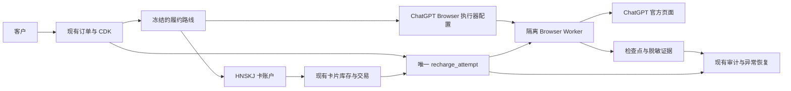
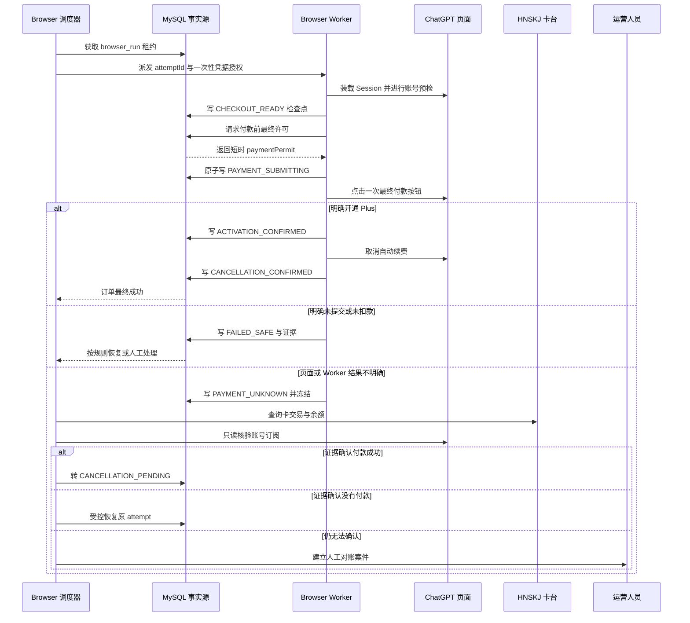

# Browser 自动充值执行器需求与架构基线（2026-08-21）

> 状态：用户已确认方向，作为 Browser 项目的设计单一事实源。
>
> 当前阶段只做可实施设计和接口固化：不接生产、不真实开卡、不提交真实付款、不启动生产 Browser Worker。
>
> 本文与 `FINAL_REQUIREMENTS_BASELINE_2026-08-21.md` 或 `DECISIONS.md` 冲突时，以最新运行事实和 `DECISIONS.md` 中当前有效决策为准；发现冲突必须先回写文档，不得只在聊天上下文中修正。

## 1. 一句话目标

复用现有 Plus 运营系统的订单、CDK、卡片、资金栅栏、审计和异常处理能力，以 HNSKJ 提供虚拟卡，由隔离的 Browser Worker 直接在 ChatGPT 官方页面完成 Plus 购买、开通确认和取消自动续费，并具备每天 200–300 单的批量履约能力。

## 2. 已确认的范围

### 2.1 必须实现的业务能力

1. 客户继续通过现有 CDK 和完整 ChatGPT Session 创建订单。
2. 目标账号必须是免费账号；当前已是 Plus 时不得付款，原订单进入可更换 Session 状态。
3. 正常订单优先使用合格库存卡；库存不足时按现有规则人工或受限自动开卡。
4. 卡片由 HNSKJ 卡台提供；新开卡和既有卡补余额继续遵守稳定幂等键、余额门槛和交易审计规则。
5. Browser Worker 使用订单 Session 进入 ChatGPT，在官方购买页面选择 Plus 并填写订单专属卡片。
6. Browser Worker 在付款前执行账号、产品、价格、币种、卡片、资金栅栏和急停复核。
7. 付款后必须确认账号已开通 Plus，并继续取消自动续费。
8. 只有 Plus 开通成功且取消续费已确认，订单才能进入最终 `RECHARGE_SUCCESS`。
9. 支持队列化、多 Worker、批量派发、人工接管、崩溃恢复和对账。
10. 目标稳定容量为每天 200–300 单，设计容量至少按每天 300 单并留有峰值余量。

### 2.2 明确放弃的方向

- Browser 项目不继续投入 ZZSHU API 的适配、错误码、幂等、状态轮询或扩容工作。
- 新 Browser 链路不依赖 ZZSHU 的可用性、订单号、`card_key` 或取消续费字段。
- ZZSHU 现有代码和历史记录只作为旧系统兼容资产处理；本设计不要求立即删除，也不允许它阻塞 Browser 项目。
- Browser 不是 ZZSHU 的页面壳，也不是在 ZZSHU 页面上模拟调用；它直接操作 ChatGPT 官方购买和订阅管理页面。

### 2.3 当前不做

- 不接生产或执行真实付款；
- 不实现 Pro 5X、Pro 20X；
- 不建立第二套订单、CDK、卡池、资金账或运营后台；
- 不自动跨订单复用卡片；
- 不在结果未知时自动重新付款、换卡、换 Worker 或换执行路线；
- 不自动解决验证码或 3DS，首版采用人工接管；
- 不做自动退款识别、提醒或余额提取；
- 不引入微服务、Redis、Kafka、多租户或完整会计。

## 3. 架构结论

### 3.1 履约路线拆分

履约路线必须由“卡片来源”和“充值执行器”两个独立部分组成：



目标路线示例：

```text
route_code: HNSKJ_CHATGPT_BROWSER_PLUS_V1
product: chatgpt_plus
card_provider_account: HNSKJ production account
executor_kind: BROWSER
executor_profile: CHATGPT_PLUS_BROWSER_V1
```

订单创建后冻结路线版本。之后即使默认路线、浏览器版本或页面策略发生变化，历史订单也必须保留原路线和配置版本。

### 3.2 系统职责

| 组件 | 负责 | 不负责 |
| --- | --- | --- |
| 订单核心 | CDK、订单、Session 更换、业务状态、路线冻结 | 操作网页 |
| 卡片服务 | 库存资格、分配、开卡、补余额、交易同步 | 判断 Browser 是否可重付 |
| 资金栅栏 | 为订单建立唯一资金风险尝试、阻止重复付款 | 识别页面元素 |
| Browser 调度器 | 创建运行、派发、租约、并发和恢复决策 | 保存 Session 或卡片明文到任务载荷 |
| Browser Worker | 页面预检、购买、开通确认、取消续费 | 创建第二个业务订单或绕过资金栅栏 |
| 对账服务 | 组合账号状态、页面证据、卡交易和余额判断结果 | 在证据不足时猜测成功或失败 |
| 运营后台 | 批量运营、人工接管、急停、审计和异常处置 | 在后台外另起无法追踪的付款流程 |

### 3.3 Browser 是执行器，不是 Provider 账户

现有 `fulfillment_routes.recharge_provider_account_id` 偏向 API Provider。Browser 实施时应新增独立的 `executor_profiles`，而不是把 Browser 伪装成 ZZSHU 或虚构一个外部充值账户。

兼容规则：

- `executor_kind=API`：使用 `recharge_provider_account_id`；
- `executor_kind=BROWSER`：使用 `executor_profile_id`；
- 两种执行器共用 `recharge_attempts`；
- Browser attempt 的 `provider_account_id` 可以为空，并增加 `executor_profile_id`；现有仓储层不得再强制所有 attempt 都具有充值 Provider 账户；
- HNSKJ 的开卡、查卡、补余额和交易调用继续写 `provider_calls`；
- 浏览器页面动作写 `browser_runs` 和追加式检查点，不伪造为 HTTP Provider 调用。

## 4. 端到端主流程

### 4.1 正常流程

1. 客户使用已付款 CDK 和完整 Session 创建 Plus 订单。
2. 系统冻结 `HNSKJ + CHATGPT_BROWSER` 路线版本。
3. 订单服务校验 Session 基本结构、有效期和目标账号标识。
4. 卡片服务分配合格库存卡；库存不足时进入 `WAITING_FOR_CARD`。
5. 卡片就绪后，系统创建唯一 `recharge_attempt`，但付款前仍必须通过运行时门禁。
6. 调度器创建 `browser_run`，Worker 获取租约并创建每单隔离的 BrowserContext。
7. Worker 通过受控方式装载 Session，验证实际登录账号与订单账号一致。
8. Worker 确认账号当前不是 Plus，进入官方 Plus 购买页面。
9. Worker 校验产品、价格、币种、税费和预计总金额是否符合配置。
10. Worker 填写账单地址和订单专属卡片，但不在此阶段提交付款。
11. Worker 写入 `PAYMENT_ARMED` 检查点，并向订单核心请求付款前最终许可。
12. 订单核心在同一事务中复核资金栅栏、卡片绑定、急停、路线和运行所有权，记录不可逆提交意图。
13. Worker 只能持该次短时许可点击一次最终付款按钮，并立即写入 `PAYMENT_SUBMITTING`。
14. Worker 观察页面、账号订阅状态及可用的支付结果，分类为明确成功、明确未付款或结果未知。
15. 明确成功后进入 `CANCELLATION_PENDING`，打开订阅管理并取消自动续费。
16. 再次确认 Plus 已生效且续费已取消，订单进入 `RECHARGE_SUCCESS`。
17. 清理短期执行凭据，保留脱敏检查点、哈希和必要审计引用。

### 4.2 付款与恢复时序



## 5. 执行器合同

### 5.1 业务接口

Browser 执行器应实现统一的充值执行器语义，但 Browser 运行是可暂停、可恢复的长流程：

```typescript
type ExecutorKind = 'BROWSER';

type BrowserCheckpointKind =
  | 'AUTHENTICATED'
  | 'PRECHECKED'
  | 'CHECKOUT_READY'
  | 'PAYMENT_ARMED'
  | 'PAYMENT_SUBMITTING'
  | 'ACTIVATION_CONFIRMED'
  | 'CANCELLATION_CONFIRMED';

interface BrowserExecutionCommand {
  runId: string;
  attemptId: string;
  orderId: string;
  routeId: string;
  executorProfileId: string;
  expectedProduct: 'chatgpt_plus';
  expectedAccountId: string;
  cardId: string;
  resumeFromCheckpoint?: BrowserCheckpointKind;
  leaseToken: string;
  credentialGrantId: string;
}

type BrowserExecutionResult =
  | { outcome: 'COMPLETED'; activationConfirmed: true; cancellationConfirmed: true }
  | { outcome: 'WAITING_FOR_SESSION'; reasonCode: string }
  | { outcome: 'FAILED_SAFE'; reasonCode: string; paymentSubmitted: false }
  | { outcome: 'PAYMENT_UNKNOWN'; reasonCode: string }
  | { outcome: 'CANCELLATION_PENDING'; activationConfirmed: true }
  | { outcome: 'HUMAN_REQUIRED'; interventionType: string };
```

边界要求：

- 命令不包含 Session、PAN、CVV 或长期密钥；
- Worker 通过 `credentialGrantId` 在短时间内按需解密，授权必须绑定 `runId + attemptId + workerId`；
- Worker 不能直接把订单改为成功，只能提交带版本号的结构化结果；
- 订单核心验证当前 attempt、租约、检查点和状态后完成迁移；
- 所有重复上报必须幂等，幂等键为 `runId + checkpointSequence`。

### 5.2 付款许可

最终付款按钮不得仅凭 Worker 本地判断点击。付款许可至少绑定：

```text
attempt_id
browser_run_id
worker_id
order_version
route_id
card_id
expected_account_id
expected_product
expected_total_amount/currency range
expires_at
single_use_nonce
```

许可签发前必须原子验证：

- 订单仍由同一 attempt 占用资金栅栏；
- attempt 不是 `UNKNOWN` 或 `SETTLED`；
- Browser run 持有有效租约；
- 卡片仍绑定本订单且状态、余额、资料符合要求；
- 账号、产品、金额和路线与预检快照一致；
- `accept_new_orders` 可以关闭，但 Browser 付款写开关和该订单派发权限必须开启；
- 没有其他账号级或订单级执行者；
- 没有人工冻结、退款争议或对账案件阻止付款。

许可一经消费，不得再次签发，除非对账服务已经用确定性证据证明付款未发生，并通过受控恢复流程继续同一 attempt。

## 6. 页面步骤与定位合同

每个页面步骤必须实现“进入条件、定位策略、成功判据、失败分类、证据策略”，不得只写一串 CSS Selector。

| 步骤 | 进入条件 | 成功判据 | 主要异常 |
| --- | --- | --- | --- |
| Session 装载 | 新隔离 Context | 页面账号 ID 与订单一致 | Session 失效、账号不一致、需要交互登录 |
| 账号预检 | 已登录 | 当前账号不是 Plus | 已是 Plus、账号状态无法判断 |
| 进入升级页 | 免费账号 | 唯一识别 Plus 产品入口 | 页面漂移、地区不可用、风控页 |
| Checkout 识别 | 升级页已加载 | 产品、价格、币种、税费均可解析 | 产品不符、金额超范围、未知币种 |
| 填写账单资料 | Checkout 已确认 | 所有必填字段通过页面校验 | 卡片 iframe 变化、地址缺失、卡被拒前置校验 |
| 付款准备 | 表单完整 | `PAYMENT_ARMED` 快照落库 | 急停、卡余额变化、订单版本变化 |
| 提交付款 | 获得一次性许可 | 只点击一次并进入结果观察 | 页面断开、按钮状态未知、3DS |
| 开通确认 | 已提交付款 | 账号订阅状态明确为 Plus | 页面成功但账号状态未更新、结果矛盾 |
| 取消续费 | 已确认 Plus | 续费取消状态明确 | 管理入口漂移、取消确认失败 |

定位优先级固定为：

1. 可访问性角色和稳定可见名称；
2. 官方稳定的 `data-testid` 或表单属性；
3. 页面结构签名；
4. 版本化的最小 CSS 选择器；
5. 视觉定位只能作为人工接管辅助，不能单独授权付款。

任何关键页面的结构签名不匹配时，必须停止在付款前或进入人工处理，不能用模糊匹配猜测“Plus”“Pay”或“Confirm”按钮。

## 7. Browser 内部状态与订单映射

### 7.1 Browser run 状态

| 状态 | 是否可能已付款 | 可否自动重启页面流程 | 订单侧动作 |
| --- | --- | --- | --- |
| `QUEUED` | 否 | 可以 | 保持当前准备状态 |
| `STARTING` | 否 | 可以 | 无 |
| `AUTHENTICATING` | 否 | 可以 | 失败可转 `WAITING_FOR_SESSION` |
| `PRECHECKING` | 否 | 可以 | 账号已 Plus 转 `WAITING_FOR_SESSION` |
| `CHECKOUT_READY` | 否 | 可以 | 等待付款许可 |
| `PAYMENT_ARMED` | 否 | 有条件 | 重新预检后继续同一 run/attempt |
| `PAYMENT_SUBMITTING` | 是或未知 | 不可以重新点击 | 进入结果观察或冻结 |
| `ACTIVATION_CONFIRMED` | 是 | 只可继续取消续费 | `CANCELLATION_PENDING` |
| `CANCELLATION_PENDING` | 是 | 只可继续取消/核验 | 禁止付款 |
| `COMPLETED` | 是 | 否 | `RECHARGE_SUCCESS` |
| `FAILED_SAFE` | 明确否 | 由规则决定 | 可恢复同一 attempt 或明确失败 |
| `PAYMENT_UNKNOWN` | 未知 | 禁止 | `SUBMIT_UNKNOWN`/对账案件 |
| `HUMAN_REQUIRED` | 取决于检查点 | 取决于检查点 | 暂停并保留租约/快照 |

### 7.2 资金风险状态

- 到 `PAYMENT_ARMED` 之前：`NONE` 或 `ACTIVE`，但尚无付款提交证据；
- 许可消费并进入 `PAYMENT_SUBMITTING`：立即标记 `ACTIVE`，任何崩溃按未知处理；
- 明确付款成功：`SETTLED`；
- 无法判断：`UNKNOWN`；
- 只有确定性证明未提交/未扣款时才允许转 `RELEASED` 或恢复原 attempt。

`ACTIVE`、`UNKNOWN`、`SETTLED` 都必须阻止创建第二个资金风险 attempt。账号级锁不能替代这条订单级资金栅栏。

## 8. 崩溃和异常恢复矩阵

| 故障点 | 自动动作 | 禁止动作 |
| --- | --- | --- |
| 浏览器启动失败 | 释放 run 租约并有界重试 | 创建新订单或新卡 |
| Session 装载前崩溃 | 新 Context 从头预检 | 消耗更换 Session 次数 |
| Checkout 填表前崩溃 | 新 Context 重新预检 | 直接跳到付款按钮 |
| `PAYMENT_ARMED` 后、许可消费前崩溃 | 许可过期；重新做付款前检查 | 沿用过期许可 |
| 许可消费后、点击动作返回前崩溃 | 立即 `PAYMENT_UNKNOWN` | 新 Worker 再点付款 |
| 点击后页面超时或断网 | 账号状态＋卡交易＋余额对账 | 仅凭超时判断失败 |
| 页面显示成功但账号仍非 Plus | 等待并对账 | 直接最终成功或重付 |
| 账号 Plus、卡交易未同步 | 进入取消流程并持续补证 | 因交易延迟重新付款 |
| 卡交易存在但账号仍非 Plus | `RECONCILIATION_REQUIRED` | 自动重新购买 |
| 取消续费页面失败 | `CANCELLATION_PENDING`，有界重试后人工 | 将订单判充值失败 |
| Worker 丢失租约 | 立即停止交互；新 Worker按检查点恢复 | 旧 Worker继续点击 |

对账证据优先级不是单一来源决定，而是组合判断：

1. 目标账号订阅状态；
2. 官方购买/订阅管理页面的结构化结果；
3. HNSKJ 卡交易状态、金额、商户和时间；
4. 卡余额变化；
5. Browser 检查点、页面签名和脱敏截图哈希。

任何证据矛盾都进入 `RECONCILIATION_REQUIRED`，不能通过“多数投票”自动决定是否重付。

## 9. 人工接管

首版人工接管用于：

- 交互登录；
- 验证码；
- 3DS 或银行验证；
- 页面结构漂移；
- 金额、币种或产品无法确定；
- 付款后结果未知；
- 取消续费无法自动完成。

要求：

1. 人工必须接管同一个隔离 BrowserContext，而不是另开浏览器重新付款。
2. 接管前显示当前 run、attempt、订单、账号脱敏标识、卡后四位和资金检查点。
3. 接管操作需要 step-up 认证、原因和操作审计。
4. 付款按钮在未知或已消费许可时必须被控制面禁用；人工也不能绕过资金栅栏。
5. 接管期间自动 Worker 停止输入动作，但继续租约心跳和证据记录。
6. 接管结束必须选择结构化结果，不允许只写自由文本后把订单改成成功。

## 10. 运行环境与敏感数据

### 10.1 Browser Worker 隔离

- Browser Worker 独立于 Web/API 进程部署，但仍以 MySQL 为唯一业务事实源；
- 每单使用新的 BrowserContext、临时目录和下载目录；
- 不跨订单复用 Cookie、LocalStorage、SessionStorage、Cache、Service Worker 或下载文件；
- 固定并记录 Playwright、浏览器、操作系统镜像和页面策略版本；
- Worker 只允许访问配置批准的 ChatGPT、支付/3DS 域名和内部控制面；
- HNSKJ API 由现有卡片服务调用，不把卡台 API Key 交给 Browser Worker。

### 10.2 凭据和证据

- Session、Cookie、PAN、CVV 和完整账单资料必须加密保存，并通过短时授权按需解密；
- 任务 JSON、普通日志、错误栈、指标标签、截图文件名和通知中不得出现敏感明文；
- 卡片输入期间关闭 DOM 快照、Playwright trace、HAR 和视频录制；
- 默认不录制整场视频；只在关键节点保存经过裁剪/脱敏的证据，或保存页面签名与内容哈希；
- CVV 不进入日常后台；执行完成后按既有卡片凭据清理策略处理；
- Session 更换后旧 Session 明文不可恢复，保留变更审计但不长期保存旧值；
- Browser 证据必须有保留期限和销毁任务，期限由上线前安全评审冻结。

### 10.3 必须先验证的 Session 事实

现有订单 Session JSON 是否能够稳定建立 ChatGPT 网页登录态尚不能仅靠现有直充 API 经验推断。实施前必须在隔离、非付款 PoC 中验证：

- `sessionToken`/`accessToken` 与网页 Cookie 的映射；
- Cookie 域、名称、SameSite 和过期行为；
- Session 是否绑定设备、地区或风控环境；
- 页面账号 ID 与订单账号 ID 的可靠比对方法；
- Session 失效、需要重新登录和验证码的可判定信号。

验证结果必须写入 `docs/contracts/`，再冻结 Session 装载实现。

2026-08-21 已完成用户提供上号器和仓库 legacy `session-auth.js` 的静态分析，结论见 `contracts/2026-08-21_browser-session-bootstrap-static-analysis-report.md`：采用新的最小 Browser Session Adapter，只复用 Cookie 解析、分块和真实只读验证思路；禁止复用 auth API 伪造、Bearer header 注入或 localStorage bootstrap。真实 Cookie 名、分块规则和账号字段仍须通过非付款 PoC 冻结。

## 11. 批量调度与容量

### 11.1 调度模型

- 继续使用 MySQL 任务、租约和有界重试；
- 一个 Browser Worker 同时只操作一个付款中的 BrowserContext；
- 不同 Worker 可并发处理不同订单；
- 同一订单、同一 ChatGPT 账号和同一卡片必须互斥；
- 人工接管任务不阻塞正常队列；
- 付款结果对账任务优先级高于新订单预检；
- 停止新接单不停止已付款订单的开通确认、取消续费和对账。

### 11.2 初始容量假设

目标 300 单/日平均约 12.5 单/小时。若单次端到端 Browser 占用 5–10 分钟，理论平均并发低于 3；为覆盖峰值、页面等待和人工任务，实施基线按 6 个并发 Worker 起步，并支持配置扩展到至少 12 个。该数值是容量规划起点，不是生产放量承诺。

### 11.3 容量验收

在不真实付款的仿真环境先验证：

- 24 小时内处理不少于 350 个模拟订单；
- Worker 随机崩溃、租约过期和重复投递不产生第二次付款动作；
- 同一账号和卡片不会并发；
- 人工队列积压不阻塞普通预检任务；
- 所有 run、attempt、检查点和审计可完整追溯；
- 调度积压、P50/P95 耗时、失败率、人工率和未知率可观测。

真实放量仍按 1 单、3–5 单、10–20 单、逐步提升并发执行；任何重复付款、资金差异、未知后重付或取消状态不一致都立即停止放量。

## 12. 建议的增量数据模型

Browser 实施采用增量迁移，不改变历史订单状态：

| 模型 | 作用 | 关键字段/约束 |
| --- | --- | --- |
| `executor_profiles` | 版本化 Browser 执行配置 | kind、code、version、environment、write_enabled、max_concurrency、config_ref、immutable |
| `fulfillment_routes.executor_profile_id` | 路线冻结具体执行配置 | Browser 路线必填；API 路线为空 |
| `recharge_attempts.executor_profile_id` | 冻结 attempt 实际使用的 Browser 配置 | Browser attempt 必填；`provider_account_id` 可为空 |
| `browser_runs` | 一次可租约、可恢复的 Browser 运行 | attempt_id、run_no、status、worker_id、lease、profile_version、last_checkpoint |
| `browser_checkpoints` | 追加式步骤和资金边界证据 | run_id、sequence、kind、payment_risk、page_signature、result_json、created_at |
| `browser_evidence` | 脱敏证据索引 | checkpoint_id、evidence_type、object_ref、sha256、redaction_state、expires_at |
| `browser_interventions` | 人工接管全过程 | run_id、type、status、operator、reason、started_at、finished_at、result |
| `execution_resource_leases` | 账号/卡片/订单互斥 | resource_type、resource_key_hmac、run_id、lease_until；有效资源唯一 |
| `payment_permits` | 最终点击的一次性许可 | attempt_id 唯一、run_id、nonce_hash、snapshot_hash、expires_at、consumed_at |
| `credential_grants` | Worker 的短时解密授权 | run_id、worker_id、scope、expires_at、consumed_at；不保存凭据明文 |

强约束：

- 一个 `recharge_attempt` 同一时刻最多一个活动 `browser_run`；
- 一个 attempt 最多一个已消费的 `payment_permit`；
- 检查点只追加，不覆盖历史；
- `PAYMENT_SUBMITTING` 检查点、许可消费和 attempt 风险状态更新必须原子提交；
- 页面结果、截图或人工结论不能直接绕过数据库约束创建第二次付款机会。

## 13. 运营后台复用与新增页面

现有 Plus 后台继续作为唯一运营入口，需要新增以下视图和操作：

1. Browser 总览：队列深度、运行中、付款待确认、人工接管、页面漂移、Worker 健康和版本分布；
2. Browser 订单时间线：路线、attempt、run、检查点、卡交易、订阅状态和取消状态；
3. 人工接管台：进入同一 Context、step-up、动作审计和结构化结束；
4. 异常恢复台：`PAYMENT_UNKNOWN`、账号/交易矛盾、取消待确认和证据缺失；
5. 批量运营：批次进度、成功率、人工率、未知率、平均耗时和失败原因；
6. 配置中心：Browser 写开关、并发、速率、金额/币种范围、页面策略版本和 Worker 版本；
7. Worker 管理：心跳、租约、当前 run、浏览器版本、最近错误和安全下线。

危险操作必须具有明确确认、step-up 和事件审计。运营人员不能通过“强制成功”掩盖付款或取消状态不明确。

## 14. 可观测性和告警

至少记录：

- 队列深度、最老任务年龄、租约超时数；
- 各页面步骤成功率和耗时；
- Session 失效率、账号已 Plus 比例；
- Checkout 页面签名版本与漂移次数；
- 卡拒绝率、3DS率、验证码率、人工接管率；
- `PAYMENT_UNKNOWN` 数量和持续时间；
- 开通确认耗时、取消续费确认耗时；
- 每个 Worker 的成功率、崩溃率和版本；
- 每条路线的订单量、成功率和资金差异。

需要立即告警：

- 任何疑似重复付款；
- `PAYMENT_UNKNOWN` 新增或长期未处理；
- 页面结构签名大面积变化；
- 卡交易与账号订阅状态矛盾；
- 付款成功但取消续费长期未确认；
- Worker 在失去租约后仍产生页面动作；
- 敏感信息进入普通日志或证据未脱敏。

## 15. 分阶段实施和退出条件

### 阶段 B0：设计冻结

产物：本文、接口合同、状态/恢复矩阵、数据迁移草案、后台清单和测试计划。

退出条件：业务目标、ZZSHU 剔除、路线模型、资金边界、人工介入和容量目标均写入单一事实源，且不存在仅保留在聊天中的重大结论。

### 阶段 B1：非付款 Browser PoC

状态：Session 上号器与 legacy 注入逻辑的静态分析已完成；真实网页登录 PoC 尚未执行。

只验证 Session 装载、账号识别、Plus 状态识别、升级入口、Checkout 页面识别和订阅管理入口，不填写真实卡、不点击付款。

退出条件：页面步骤、定位策略、Session 合同、页面签名和失败分类具有可重复证据。

### 阶段 B2：控制面和仿真实现

实现 executor profile、run、检查点、租约、一次性付款许可、模拟页面适配器和后台只读视图。

退出条件：崩溃、重复投递、失租约和付款未知仿真均不能产生第二次付款动作；350 单/24 小时容量仿真通过。

### 阶段 B3：隔离联调

接入 Browser Worker 与现有订单、HNSKJ 卡片服务、资金栅栏、审计和人工接管，但保持生产付款写开关关闭。

退出条件：端到端仿真订单可追溯，敏感数据不进入日志/任务/证据，后台能够完整处置所有异常。

### 阶段 B4：受控真实验证

仅在现有订单/卡片/Session/终态主线稳定且获得单独操作确认后，按 1、3–5、10–20 单逐级验证。

退出条件：没有重复付款、资金差异、未知后重付或取消状态矛盾，人工恢复路径有真实证据。

### 阶段 B5：容量放量

逐步提高 Browser Worker 并发和每日批量，目标达到每天 200–300 单。

退出条件：容量、成功率、延迟、人工率、未知率、页面漂移恢复和资金对账全部达到运营门槛。

## 16. 首批实施任务顺序

1. 冻结 Browser Executor 接口和页面步骤合同；
2. 进行非付款 Session/页面 PoC，并把事实写入 `docs/contracts/`；
3. 设计 `executor_profiles`、`browser_runs`、检查点、资源锁和付款许可的增量迁移；
4. 实现模拟 Browser 适配器及崩溃/重复投递测试；
5. 接入现有 `recharge_attempts`、卡片服务和订单状态机；
6. 实现隔离 Browser Worker；
7. 实现后台 Browser 总览、人工接管和异常恢复；
8. 完成 350 单/24 小时无真实付款容量测试；
9. 在单独确认后进入受控真实验证；
10. 达标后逐步放量到每天 200–300 单。

## 17. 重大节点的信息布盘规则

以下事件发生时必须在同一工作节点回写项目文档：

- 用户确认或改变业务方向；
- 页面、Session、支付、3DS或取消续费出现新运行事实；
- 资金状态、重复付款边界或恢复策略改变；
- 数据模型或接口合同冻结；
- PoC、仿真、灰度或容量阶段完成；
- 发生生产事故、未知付款或页面大面积漂移；
- 默认路线、卡台账户、Browser 策略或 Worker 版本切换。

至少更新：

1. 本文的现状、事实和后续步骤；
2. `DECISIONS.md` 的新增/替代决策；
3. 对应 `docs/contracts/` 运行合同或验证记录；
4. 实施计划/路线图的阶段状态；
5. 跨窗口交接文档的已完成、未完成、风险和下一动作。

禁止把重大结论只留在聊天、终端输出、代码注释或某个模型的临时总结里。

## 18. 当前已冻结结论与待实证事实

### 已冻结结论

- Browser 是未来 Plus 充值的独立主执行链路，不依赖 ZZSHU；
- 路线为 HNSKJ 卡片来源加 ChatGPT Browser 执行器；
- Browser 复用现有订单、卡片、资金栅栏、审计和运营后台；
- 每单隔离 BrowserContext；
- 每单只有一个资金风险 attempt；
- 付款后不明确时禁止重付；
- 成功必须包含 Plus 开通和取消续费确认；
- 首版验证码与 3DS 采用人工接管；
- 目标容量每天 200–300 单；
- 当前只设计和落盘，不接生产、不真实付款。

### 必须通过 PoC 获得证据的事实

- 现有 Session JSON 建立网页登录态的可行性和稳定性；
- ChatGPT 免费/Plus 状态的可靠读取方式；
- 官方升级、Checkout 和订阅管理页面的实际结构；
- Checkout 使用的支付 iframe、币种、税费和 3DS 行为；
- 付款成功、失败、处理中和未知页面的可靠区分；
- Plus 开通后的传播延迟；
- 取消自动续费的入口、确认信号和延迟；
- HNSKJ 卡交易对官方支付的商户、授权、入账、拒绝和撤销表现；
- 单机 Browser Worker 的真实耗时、资源占用和合理并发。

这些事实未验证前不得伪装成已知合同，也不得用于打开生产付款写开关。
