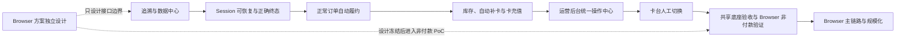

# 最终实施规划与验收路径（2026-08-21）

> 状态：用户已确认。执行主线以本文为准；需求语义以 `FINAL_REQUIREMENTS_BASELINE_2026-08-21.md` 和 `DECISIONS.md` 为准。
>
> 输入依据：两轮对抗式审查、Plus 运营后台对齐审查、当前代码/生产静态资源和历史真实 Provider 证据。
>
> 当前约束：Browser 自动化现在单独设计并作为未来 Plus 主执行链路；先完成非付款 PoC、控制面和仿真验证，未取得单独操作确认前不接生产、不真实付款。ZZSHU 不再是 Browser 项目的投入方向。

## 1. 执行原则

- 先把证据和追溯做完整，再扩大自动资金动作；
- 保留现有认证、CDK、库存、订单、Provider 调用、交易、对账和资金栅栏底座；
- 正常订单自动履约，但任何外部结果未知都禁止自动重付；
- 所有数据库变化采用可回放的增量迁移，不破坏历史订单；
- 每阶段必须通过代码测试、隔离 MySQL、后台验收和生产只读/受控验证后才进入下一阶段；
- 生产真实写动作保持单笔、可审计；未达到阶段退出条件不得提前放量。

## 2. 总体路径

## 3. 阶段一：追溯与数据中心

**状态：已完成实施、独立对抗审查、隔离 MySQL 和生产安全部署验收。**

实施证据见 `STAGE1_TRACEABILITY_ACCEPTANCE_2026-08-21.md`。特殊人工复用的操作入口与复用后交易归属按本文阶段四实施；本阶段已完成历史账本并禁止自动复用。

### 实施内容

1. 后台统一搜索支持：CDK、订单查询码、邮箱、ChatGPT 账号 ID、完整卡号精确查询、后四位、卡台卡 ID、Provider 订单号、时间范围、状态、失败原因和标签；
2. 完整卡号使用独立 HMAC 索引，明文继续加密保存，不建立明文数据库索引；
3. 增加卡片绑定历史，记录绑定、释放、特殊复用、原/新订单、操作者、原因、余额和交易快照；
4. 将已有 CDK delivery API 接入后台，记录交付、补发、失败和客户引用；
5. 原 CDK、补发 CDK、原订单和后续订单建立双向关系；
6. 增加订单标签、人工备注和完整时间线；
7. 建立客户收款记录：渠道、金额、币种、付款时间和外部引用；它关联 CDK/订单，不改变“CDK只绑定产品、不绑定价格”；
8. 建立履约成本视图：开卡金额/费用、卡充值/手续费、Provider 支付、卡消费、余额、退款/取回；不同币种保留原值，不猜测汇率。

### 退出条件

- 仅凭 CDK、邮箱或卡号能找到全部相关订单；
- 订单能反查 CDK、卡片、Provider 调用、交易、取消续费和人工案件；
- 任意特殊复用后仍能看到卡片所有历史订单；
- 能区分客户付款与系统履约成本；
- 历史数据迁移不改变原订单状态。

## 4. 阶段二：Session 可恢复与正确终态

**状态：已完成代码、增量迁移、隔离 MySQL、独立对抗式审查和生产安全部署。**

实施证据见 `STAGE2_SESSION_FINALIZATION_ACCEPTANCE_2026-08-21.md`。正式成功充值与取消续费真实验收仍属于后续受控验证，不因本阶段测试全绿而视为完成。

### 实施内容

0. 增加付款前目标账号资格闸门；当前为 Plus 时应在 Provider create 之前进入客户可恢复状态。闸门的实现必须优先复用同一 Browser Context/同一 sticky 出口下的必要只读状态读取，或经过证据确认的低副作用 Provider 只读接口；未经非付款 PoC/A-B 验证，不新增独立登录、切换出口或重复私有接口探测。ZZSHU `40030` 只能作为安全拒绝兜底，不能写成已完成的本地预检。
1. 增加 `WAITING_FOR_SESSION`；
2. 增加原订单更换 Session 的客户接口和页面；
3. 最多 3 次，72 小时从首次客户可修复错误开始；
4. Plus/Session 无效映射成客户可理解原因，库存和系统问题不对客户暴露；
5. 允许更换账号，记录账号变更，不长期保存旧 Session 明文；
6. 增加 `CANCELLATION_PENDING` 和 `CANCELLATION_REVIEW_REQUIRED`；
7. 只有 Provider 成功且 `is_subscription_cancelled=1` 才最终 `RECHARGE_SUCCESS`；
8. 更新客户轮询、后台成功率、筛选和时间线。

### 退出条件

- Plus 账号能在原订单更换 Session，不重新消耗 CDK；
- 库存等待不消耗 72 小时或更换次数；
- 支付成功但取消未知时不显示成功、不显示失败、不重付；
- 取消确认后客户与后台同时进入最终成功。

## 5. 阶段三：正常订单自动履约

### 实施内容

1. 正常已付款订单不再依赖运营者逐单 Permit；
2. 规则通过后系统自动建立唯一 `recharge_attempt` 和 Provider 调用意图；
3. 保留全局接单/派发/Provider 写开关、单订单资金栅栏、UNKNOWN 锁定和紧急停止；
4. 人工 Permit 降级为灰度、紧急或特殊订单工具；
5. 配置型阻塞进入可恢复等待，不直接 DEAD；
6. 完成 `provider_calls` 与 `recharge_attempts` 一一关联核验；
7. API 与未来 Browser 共用同一资金栅栏。

### 退出条件

- 正常订单无需人工点击；
- 并发、Worker 崩溃和重复任务不能产生第二次 Provider 创建；
- 外部结果未知时 API/Browser 均不能重付；
- 停止新接单不影响已有订单轮询。

## 6. 阶段四：库存、自动补卡与卡充值

### 实施内容

1. 统一库存资格：active、未绑定、无客户成功 PURCHASE、资料/余额达标、无资金未知、退款/拒付争议或隔离；
2. 所有统计、阈值、分配和后台列表共用同一资格查询；
3. 增加显式 `WAITING_FOR_CARD`；
4. 自动补卡：每次 1 张、每张 $16、每天自动最多 5 张；人工开卡不计入上限；
5. 接入 HNSKJ `POST /cards/{id}/recharge`；
6. 新开卡用 `openCardAmount` 开足；仅未履约、未绑定、余额不足的 active 卡补余额；
7. 卡充值持久化幂等键、金额、手续费、Provider 调用、pending、余额和流水；
8. 增加受控人工特殊复用入口，系统禁止自动复用。

### 退出条件

- 消费过、资金未知或有争议的卡不能进入正常库存；
- 每日第 6 张自动开卡被硬性阻止，人工开卡不受该自动计数影响；
- recharge pending 时不会更换幂等键重打；
- 特殊复用必须二次确认并产生完整历史。

## 7. 阶段五：运营后台统一操作中心

### 实施内容

1. 总览增加等待 Session、等待补卡、取消待确认、资金未知、自动开卡用量和 Provider 健康；
2. 移除“待确认充值”作为正常核心指标；
3. 订单、CDK、卡片、Provider、交易和案件互相跳转；
4. CDK 页面完成生成、交付、补发、作废和支付记录；
5. 卡片页面完成补余额、绑定历史和特殊复用；
6. 设置页集中管理最低余额、库存阈值、自动补卡参数、卡段、Provider 门禁、并发和急停；
7. 客户原因和内部原因分层展示。

### 退出条件

- 正常运营不需要直接 SQL；
- 所有正常、等待和异常路径都有后台入口；
- 危险操作有 step-up、明确确认和事件审计；
- 页面口径与统一查询一致。

## 8. 阶段六：卡台人工切换

### 实施内容

1. Provider 账户和履约路线管理页；
2. 切换前检查健康、余额、卡段、额度、权限和写开关；
3. 切换只影响新订单；
4. 旧订单保留原路线和全部历史；
5. 保存切换前后配置、操作者、时间和原因；
6. 当前不做自动故障转移。

### 退出条件

- 不改数据库即可人工切换新订单卡台；
- 不健康或未启用写权限的路线不能被设为新订单路线；
- 历史订单查询和处理不受默认路线切换影响。

## 9. 阶段七：共享底座验收与 Browser 非付款验证

ZZSHU 正式成功链路不再是 Browser 项目前置条件。本阶段只验证 Browser 需要复用的共享底座，以及不产生真实付款的页面事实。

### 验证顺序

1. 验收 CDK→订单→Session 恢复→卡片→唯一资金 attempt→审计/对账的共享链路；
2. 验收 HNSKJ 库存、开卡、补余额、交易同步和一卡一单约束；
3. 进行非付款 Browser PoC：三模式 Session、三档 Cookie policy、Session Loader v2、离线路由复现、两轮公开实现调研、hosted Checkout 提链源码研究、多赛道基线、schema v2 无 Session 公开对照和第一轮架构对抗式审查已完成；继续分别实现原上号器真实 Chrome、ChatGPT 站点状态克隆+CDP、Loader 同 Context UI、hosted 分离 Context和页面 Context hosted；菲律宾 sticky 出口下先做同账号只读配对，再用隔离账号 cohort 比较会创建 Checkout 的赛道，验证账号识别、Plus 状态、第二 Context 打开、产品/PHP 金额/主体一致性和订阅管理入口；
4. 冻结页面签名、Session 合同、失败分类和人工介入点；
5. 使用模拟页面验证 Browser run、检查点、租约、一次性付款许可和结果未知恢复；第一版编排器、租约、artifact vault、接管所有权、预路由、mock gateway、本地追加式 WAL、WAL-backed 状态变更、真实 BrowserContext/iframe/popup 页面、随机崩溃、重复投递、租约过期、人工接管中断和页面漂移均已完成；MySQL 事务映射 v1 以及跨进程 artifact 密文/四类资源租约 Repository 也已完成并通过隔离 MySQL 8.4；
6. 完成不少于 350 单/24 小时的无真实付款容量仿真；第一轮 350 单等效仿真已通过（350 submit、0 duplicate，38.14 秒），后续补并发队列和连续 24 小时 soak，不把等效仿真写成真实连续运行事实。

当前主工程关键路径固定为：MySQL 事务映射、artifact vault/资源租约跨进程恢复、后台追溯/人工控制（均已完成 v1）→ 先补 Browser attempt/dispatch 与付款后 Plus 激活/取消闭环 → 并发队列、真实多连接竞争、连续 24 小时 soak → 隔离 Browser Worker 与人工同 Context 通道接入。2026-08-22 第二轮对抗审查见 `docs/2026-08-22_browser-control-plane-adversarial-review-report.md`，在上述 P0 闸门关闭前不得宣称 Browser 批量能力已验证。公开提链源码静态审查属于可并行、非阻塞研究，不得排到该关键路径之前。市场上的菲律宾 CDK 默认按现有 CDK-API/Provider 路线归类，不建立新的业务路线；其实际上游是否同源须以后用接口和运行证据确认。

### 停止条件

- Session 无法可靠建立或比对目标网页账号；
- 同一账号可能并发持有两个活动 run/Checkout artifact，或变更实验存在跨 lane 账号污染；
- 付款许可、租约或资源锁存在产生第二次点击的窗口；
- Worker 崩溃或重复投递能够越过检查点；
- 敏感数据进入日志、任务、trace 或未脱敏证据；
- hosted URL/fragment 进入普通数据库、截图、HAR、通知或可复制后台字段；
- run、attempt、卡片、订单或人工操作追溯链缺失。

## 10. 阶段八：Browser 主执行链路与规模化

### 现在单独设计

独立讨论窗口只产出：

- Browser 主链路需求与架构基线；
- Browser 执行器接口合同；
- 运行环境和账号/Session边界；
- 页面步骤与元素定位；
- 登录、验证码、3DS和人工介入点；
- 崩溃恢复；
- 付款前/付款后检查点；
- 结果未知处理；
- 与订单、Provider 路线和资金栅栏的集成方案。

设计成果必须回写本项目，不建立第二套订单、卡池或资金账。为了先跑通 Browser，现有 Provider 抽象、路线表结构、许可命名和运营后台布局允许最小调整；不可删除的硬边界只有防重复扣款、付款未知禁止自动再付和完整审计链。当前冻结基线见 `BROWSER_RECHARGE_EXECUTOR_BASELINE_2026-08-21.md`。

### 后期实现

Browser 后期实现不依赖 ZZSHU；它使用 HNSKJ 卡片并直接操作 ChatGPT 官方购买和订阅管理页面。实施顺序为：

- 完成非付款 Session/页面 PoC，并冻结 champion 与最多一个可在 Checkout 创建前路由的预验证 fallback；
- 实现 Browser run、检查点、资源锁、一次性付款许可和仿真页面适配器；
- 实现隔离 Browser Worker；
- 接入共同的 `recharge_attempts`；
- 明确 Browser attempt 创建分支与现有 Provider route 的边界，不能从通用入口旁路创建第二套订单/资金状态；
- 将付款确认、Plus 激活观察、取消确认和延迟生效纳入最终成功判定；
- 任何旧 API 未知订单禁止切 Browser，新 Browser 订单不调用 ZZSHU；
- Browser 付款后崩溃禁止重新付款；
- Checkout 过期或打不开不得仅凭时间自动重建，账号/订单/卡片/artifact 四类资源锁通过故障注入；
- 完成 350 单/24 小时无真实付款仿真，并明确串行等效仿真不能替代并发队列与 24 小时 soak；
- 经单独确认后按 1 单、3–5 单、10–20 单受控验证；
- 完成 200–300 单/日容量、限流、延迟、余额和失败率验收；
- Plus 稳定后再讨论 Pro 5X、Pro 20X。

## 11. 当前明确不做

- CDK 作废后回收再利用；
- 自动退款识别、提醒、确认或提取；
- 卡台自动故障切换；
- 自动跨订单复用卡片；
- Pro 充值；
- 多租户、微服务、Redis/Kafka或完整会计；
- API/Browser 在结果未知时自动换路重付。

## 12. 立即开始时的第一批任务

1. 设计并迁移追溯数据：卡片绑定历史、收款记录、交付/补发关系、标签/备注和 PAN HMAC；
2. 完成统一搜索和订单档案只读页面；
3. 增加 Session/取消续费新状态和迁移；
4. 为上述状态编写数据库、服务和客户 API 测试；
5. 在不打开生产资金写开关的情况下发布并验收追溯与状态基础。
