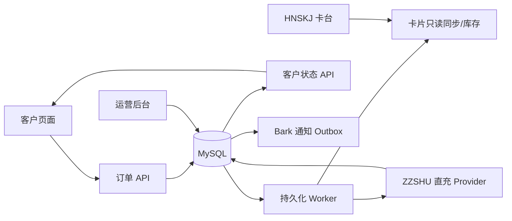

# AI充值业务：从项目起点到当前状态的完整交接

> 版本：2026-08-21
>
> 用途：跨窗口、跨模型接手的项目总交接。本文把历史聊天、Git 记录、当前代码、项目文档和已记录的生产证据分开表述。没有证据的内容统一标为“未确认”或“规划”，不把推断写成事实。

> 2026-08-21 后续方向更新：Browser 已确认为未来 Plus 主执行链路，使用 HNSKJ 虚拟卡并直接操作 ChatGPT 官方购买/订阅管理页面；ZZSHU 只保留旧系统兼容。最新可实施设计见 [`BROWSER_RECHARGE_EXECUTOR_BASELINE_2026-08-21.md`](BROWSER_RECHARGE_EXECUTOR_BASELINE_2026-08-21.md)，决策见 D-038 至 D-040。

## 1. 证据规则与范围

本项目的结论按以下顺序处理：

1. 生产运行时、真实请求和真实响应；
2. 生产数据库状态和发布状态；
3. 当前发布资源、当前代码和自动化测试；
4. Git 提交和项目文档；
5. 历史聊天中的建议、推断和待办。

历史聊天是项目决策的证据来源，但聊天里的“建议”“可能”“应该”不等于已实现事实。本文保留这些内容时，会明确标注其性质。

已核对的历史会话范围包括：

- 2026-08-16：项目起点、上号器/卡台/API 方案讨论；
- 2026-08-17：v1 重构、安全审查、MySQL/服务器接入和后台建设；
- 2026-08-18：独立真实 Plus Provider PoC；
- 2026-08-19：正式订单付款前验证、卡池方向、零成本运营闸门；
- 2026-08-20：Foundation v2、后台/CDK/对账和全局恢复；
- 2026-08-21：生产准备、UI 收尾、真实失败链路和 Plus 规则纠正。

## 2. 项目最初是什么

2026-08-16，用户提出的原始目标是：已有虚拟信用卡卡台，能够拿到客户 ChatGPT Session，希望“一卡一冲”批量为客户购买 ChatGPT Plus，并将流程自动化；卡台供应商还提供了“上号器”扩展插件。

最初讨论过的浏览器自动化方案是探索性建议，不是最终架构决定，包含：

- 订单编排；
- 卡片一单一锁；
- 独立浏览器上下文加载 Session；
- 官方结账页支付；
- 3DS/验证码转人工；
- 支付后核验订阅；
- 失败时冻结或复核卡片。

随后对卡台开放 API、对接文档和站点进行核对，发现文档描述的是异步直充 API：提交完整 Session、银行卡字段和套餐，后台 Worker 执行并轮询结果。实际站点与文档的 API Base URL 存在差异，站点根地址上的文档 API 路径曾返回 404。因此项目从“自己控制浏览器”为主的设想，转为“供应商 API + 自有订单/Worker/审计系统”为主；上号器和 legacy 浏览器能力不进入 v1 生产路径。

## 3. 已确认的业务共识

以下是用户明确确认、并已写入决策账本的业务原则：

| 编号 | 共识 | 当前状态 |
| --- | --- | --- |
| 1 | v1 只做 ChatGPT Plus，不做 Pro | 已确认 |
| 2 | 一单一卡；同一张卡同一时间只能绑定一个订单 | 已确认 |
| 3 | 未知外部结果禁止自动重试或换卡重提 | 已确认 |
| 4 | CDK 一次兑换；失败订单不自动退回可用 | 已确认 |
| 5 | MySQL 状态机、任务租约和资金栅栏负责运行，AI 不参与实时资金决策 | 已确认 |
| 6 | 手动开卡是当前默认主流程；系统使用预先开好的库存卡 | 已确认 |
| 7 | 自动开卡、批量补卡和开卡后台后置，不是当前 MVP 必做项 | 已确认 |
| 8 | 充值仍需单笔/批次人工资金闸门和一次性 Permit | 已确认 |
| 9 | 退款当前只识别和提醒，人工确认/提取延期 | 已确认 |
| 10 | 通知使用 Bark，不采用 Telegram | 已确认 |
| 11 | 不引入多租户、微服务、Redis、Kafka 或完整会计 | 已确认 |
| 12 | 目标账号当前已经是 Plus 时禁止充值；上游也不会接受 | 已确认，硬规则 |
| 13 | “寻找支持当前 Plus 账号充值的 Provider”不是项目方向 | 已确认，原建议已撤销 |

特别说明：产品 Plus 表示要购买的产品；目标账号当前套餐为 plus 表示已经拥有 Plus，不能再次提交直充。

## 4. 项目演进时间线

### 2026-08-16：从自动化构想转为 API 订单系统

已确认：

- 用户提出卡台、Session、一卡一冲和批量自动化目标；
- 对上号器、截图和第三方开放 API 文档进行了初步核对；
- 文档显示直充入口需要完整 Session、卡号、有效期、CVV 和套餐字段；
- 异步任务和状态轮询成为后续自建系统的参考；
- 真实站点根地址与文档 API 地址不一致，不能直接把文档占位地址当生产 API；
- 最终选择自建订单、卡片、Provider 调用、任务和事件持久化边界；
- Google Play/GPA 只属于外部截图中观察到的其他业务线，不能作为本项目主链路事实。

未确认：

- 外部截图系统的具体实现方式；
- 对方是否真的使用 Google Play 或礼品卡；
- 上号器是否需要接入 v1；
- 外部文档占位 API 的真实部署地址。

### 2026-08-17：v1 基础、隔离和安全基线

Git 和代码证据显示，本阶段完成了：

- 保留原始 Fork/legacy 代码，但将浏览器池、Stripe、hCaptcha、代理等旧能力隔离；
- 建立 v1 独立生产入口，根启动默认指向 v1，legacy 需要显式解锁；
- 建立客户页面、订单提交和订单状态查询；
- 建立 CDK 生成/导入/哈希存储；
- 建立 MySQL 迁移、订单状态机、任务租约、有界重试和 Provider 调用审计；
- 实现 HNSKJ 卡台适配器和 ZZSHU 直充适配器；
- Session 加密、错误脱敏、敏感字段边界、后台会话和生产数据库配置校验；
- 建立生产部署布局、回环监听、加密备份和恢复基线；
- 完成接入前安全审查并修复 Provider 错误脱敏和 card_key 重复保存问题。

服务器只读盘点确认：生产机已有其他 VibeBridge 服务，Caddy 占用公网 80/443；v1 Web/Worker 应通过回环端口和现有反代共存，不能覆盖现有服务。

### 2026-08-18：独立 Provider 真实 Plus PoC

这次是供应商独立 PoC，不是正式订单数据库链路。已记录的真实证据：

- 使用真实卡和真实 Session；
- HNSKJ 开卡成功并进入 active；
- ZZSHU Plus 直充成功；
- 实际支付约 $15.97，对应 982.14 PHP；
- 取消续费标记已确认；
- 卡片消费和余额证据已记录。

这证明 Provider 组合曾经完成过一次真实 Plus 成功，但不证明正式 CDK→MySQL→Worker 链路成功，也不证明所有账号、卡段和后续订单都能成功。

另有一笔 $78.24 失败授权，用户后续明确说明这是用户主动点击升级套餐产生的失败扣款，不是系统自动续费；该性质以用户说明为准。

### 2026-08-19：正式订单付款前验证和运营方向调整

已完成：

- 正式客户页面创建订单并加密保存 Session；
- 真实开卡一次，卡片进入 active；
- 卡片状态、余额和凭据就绪；
- 直充请求只完成本地构造，未调用 ZZSHU 创建接口；
- Permit/资金闸门和生产收尾状态建立；
- 后台显示“付款前已就绪”“直充已锁定”。

用户随后明确要求简化系统：自己手动开卡，系统只负责发现、校验、隔离和分配已有卡；没有合适卡时等待补卡，不能自动开卡。代码当时暴露出一个事实：旧流程仍固定创建 PURCHASE_CARD 任务，并不能使用手动预开卡。之后项目增加了卡池、卡片接管、库存分配和卡台目录同步能力。

### 2026-08-20：Foundation v2 与运营层

Git 提交和验收文档显示，本阶段完成了：

- Provider 账户/产品/履约路线冻结；
- 卡片账户级唯一性、隔离批次、双快照验证和分层同步；
- 卡片库存、订单分配、余额/交易同步和对账；
- CDK 批次恢复、下载、作废、交付审计和失败补偿；
- 未提交订单取消并释放卡片；
- 充值授权、资金 fence、一次性 Permit 和 SUBMIT_UNKNOWN 处理骨架；
- 后台订单、库存、CDK、异常和安全 CSV；
- Foundation v2 生产发布验收；
- Bark 通知独立进程、脱敏、去重、退避重试、死信和恢复；
- 全局集成审查和生产准备门禁。

### 2026-08-21：生产准备、UI 收尾和真实失败链路

已完成：

- CDK 作废、通过 CDK 查询订单、后台刷新反馈；
- 下拉箭头内收；
- 待验证新卡统计按外部卡 ID 去重，排除已接管卡并取最新记录；
- 客户页面轮询窗口从 5 分钟延长到 30 分钟；
- 生产备份、Bark、只读 Provider 检查和健康检查收尾；
- 使用已有库存卡完成一笔真实客户订单到 ZZSHU create_direct 的失败分支验证。

真实失败分支证据：

```text
客户页面
→ CDK
→ Session
→ 订单
→ 已有库存卡
→ 卡片只读核验
→ Permit
→ ZZSHU create_direct
→ HTTP 400 / 40030
→ 本地 RECHARGE_FAILED
→ 客户状态 FAILED
```

ZZSHU 返回的业务原因是：当前目标账号套餐为 plus，只支持免费账号提交。该响应同时验证了“当前 Plus 账号不能充值”的硬规则。

## 5. 当前系统横向全景



### 客户平台

- 主页面：plus.vibebridge.top；备用域名：pay.vibebridge.top；
- 提交 CDK + 完整 Session；
- 使用订单查询码或 CDK 查询状态；
- 客户状态限制为 QUEUED/PROCESSING/REVIEWING/SUCCESS/FAILED；
- 不返回 Session、卡号、CVV、Provider 细节；
- 轮询最长 30 分钟，进入成功/失败终态后停止。

### 运营后台

- 入口：ops.vibebridge.top/admin；
- 支持订单查询码、CDK、邮箱、ChatGPT 账号 ID、三方外部订单号；
- CDK 生成、批次、下载、逐码状态、作废和交付审计；
- 卡片库存、卡台历史快照、待验证新卡、卡片同步和对账；
- 单订单充值 Permit 和资金风险查看；
- 敏感写操作需要登录会话、同源保护和 step-up。

### Web、Worker、MySQL 和定时任务

- 技术标识仍为 pojia，生产路径为 /opt/pojia，不能因本地目录改名而改动；
- Web 和 Worker 由 systemd 管理，Web 仅回环监听；
- MySQL 使用迁移 001–023；
- 卡片目录同步、卡片只读同步、备份和 Bark 通知使用独立服务/定时任务；
- Worker 使用租约、状态机、有限重试和资金栅栏；
- AI 不参与运行中的资金决策。

### 外部平台

- HNSKJ：卡片、余额、卡详情、卡段和交易读取；开卡属于付费写操作；
- ZZSHU：直充创建和状态查询；当前真实证据证明“当前 Plus 目标账号”会被 40030 拒绝；
- Bark：异常通知，不加载资金 Provider 密钥；
- Caddy/服务器：承载反代和既有 VibeBridge 服务，v1 必须与其隔离。

## 6. 完成状态：必须区分层级

### 已实现且有代码/测试证据

- v1 客户页面、后台、订单 API、CDK、卡片库存、Worker、Provider 适配器；
- Session 加密、CDK 哈希、错误脱敏、后台认证、同源保护、CSV 安全导出；
- MySQL 迁移、状态机、租约、任务恢复、Permit、资金 fence、Provider 调用记录；
- Bark 通知和卡片/订单对账基础；
- CDK 查询、作废、补偿、订单取消、客户轮询修复和待验证新卡统计修复。

### 已有真实生产证据

- 只读 Provider 连通和卡片目录/余额/交易读取；
- 独立 Provider 成功 PoC；
- 正式订单付款前真实开卡和停在直充前；
- 正式客户页面到 Provider 明确拒绝的真实失败分支；
- 生产 Web/Worker/健康检查/Bark/备份等运行状态。

### 只有隔离环境或本地测试证据

- 假 Provider 的完整成功、失败、超时、未知状态和重启恢复；
- 大量 MySQL 事务、迁移重放和并发测试；
- 多数后台写操作和 CDK 恢复路径；
- 资金账本和 Provider 调用关联的部分边界。

### 尚未完成或尚未真实验证

- API 路径不增加独立 Plus 预检；40030 已映射为客户可修复的 Session 状态，后台详细展示仍需生产验收；
- 每次真实 create_direct 与 recharge_attempts 的事务审计已完成阶段三历史修复和 readiness 约束，新的真实成功单仍待验证；
- 符合规则的非 Plus 目标账号成功订单；
- 新卡付费开通、开卡失败、超时和幂等重放；
- 真实 SUBMIT_UNKNOWN、退款确认、余额提取和取消续费人工路径；
- 3–5 单及以上小批量运营。

## 7. 当前生产安全状态

最近一次真实失败链路收尾后，已恢复为：

```text
accept_new_orders=false
dispatch_new_recharges=false
PROVIDER_RECHARGE_WRITES_ENABLED=false
provider_accounts.write_enabled=false
Worker=active
```

没有继续执行资金动作；最近真实失败订单没有 Provider 外部订单号，也没有确认充值扣款。

## 8. 后续顺序

### P0：下一次真实充值前

1. API 路径不增加独立账号预检；使用 Provider 明确 40030 拒绝作为权威结果并保持 Session 可恢复；
2. 验收 40030 在后台的完整失败字段和客户原因展示；
3. 继续用真实成功单核对 provider_calls、recharge_attempts、Provider 订单和卡交易；
4. Browser 路径另行验证同 Context 只读账号步骤，不把它混入 API 路径。

### P1：单笔灰度前

1. 统一进程、Provider 账户、派发开关和 Permit 的有效写状态；
2. 配置型阻塞不得伪装成不可恢复 DEAD；
3. 增加后台可审计恢复，不允许人工 SQL 重排；
4. Permit 前自动触发卡片只读同步；
5. 完成后台密码轮换和 step-up 验收。

### P2：后续真实验证

1. 使用当前不是 Plus 的测试账号验证成功充值；
2. 单独验证新卡付费开通；
3. 对账最终状态、Provider 订单、卡交易和资金账本；
4. 验证 SUBMIT_UNKNOWN、退款、取消和余额提取；
5. 成功单稳定后再做 3–5 单，保持并发 1。

## 9. 接手纪律

- 先读本文、SINGLE_SOURCE_OF_TRUTH_2026-08-21.md、DECISIONS.md、V1_SPEC.md、ROADMAP.md 和最新 progress.md；
- 先运行 pwd、git status、git log -5，确认项目目录和工作树；
- 不把历史建议、隔离测试或独立 PoC 写成生产事实；
- 不把当前已是 Plus 的账号提交给任何直充 Provider；
- 不在文档、日志、提交或聊天中保存 CDK 明文、Session、Token、PAN、CVV、API Key 或密码；
- 任何资金动作都必须逐单、可回滚、有明确授权和可审计证据；
- 发现文档与运行时冲突时，以运行时证据为准，并更新决策账本和本交接文档。

## 10. 2026-08-21 最终对齐补充

- 卡台余额充值：用户要求如果存在接口就直接使用。已核实 HNSKJ 文档存在 `POST /cards/{id}/recharge`，但当前 v1 未实现/实测；历史成功 PoC 使用的是 `POST /cards/purchase` 开卡后再调用 ZZSHU 直充，不能偷换成既有卡余额充值已验证。
- Session 更换：原订单最多 3 次，初始窗口 72 小时、可配置；不是 CDK 过期时间，只能在充值资金影响前更换。
- 备用卡台：先人工切换；新订单使用新路线，旧订单保留原路线，暂不自动故障转移。
- 最终需求经过对抗式审查并由用户确认，正式基线为 `FINAL_REQUIREMENTS_BASELINE_2026-08-21.md`；旧决策 D-006/D-008/D-009/D-016 已明确被新决策替代。
- 卡片默认一单一卡且不跨订单复用；特殊情况保留受控人工例外，系统不得自动复用，必须核实资金/退款风险并完整审计。
- 用户确认完整实施路径，见 `IMPLEMENTATION_PLAN_FINAL_2026-08-21.md`；Browser 当前可独立窗口设计，但必须等 API 正式成功链路和阶段七灰度稳定后再接生产。

## 11. 证据索引

- 项目规格：[V1_SPEC.md](V1_SPEC.md)
- 路线图：[ROADMAP.md](ROADMAP.md)
- 决策账本：[DECISIONS.md](DECISIONS.md)
- 最近事实源：[SINGLE_SOURCE_OF_TRUTH_2026-08-21.md](SINGLE_SOURCE_OF_TRUTH_2026-08-21.md)
- 对抗式复核：[ADVERSARIAL_REVALIDATED_REVIEW_2026-08-21.md](ADVERSARIAL_REVALIDATED_REVIEW_2026-08-21.md)
- 真实 PoC 验收：[MVP_ACCEPTANCE_2026-08-19.md](MVP_ACCEPTANCE_2026-08-19.md)
- 项目进度：[progress.md](../progress.md)
- Git 历史：`git log --reverse --date=short --pretty=format:'%ad %h %s'`
- 历史会话：本机 Codex session archive 中 2026-08-16 至 2026-08-21 的项目会话；敏感原文不复制进仓库。
