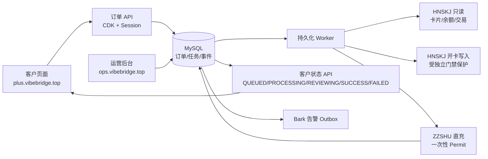

# AI充值业务单一事实源与接手手册

> 更新时间：2026-08-21 需求最终对齐补充后
>
> 本文用于跨窗口、跨模型交接。事实优先级：生产运行时与真实请求/响应 > 生产数据库状态 > 当前发布资源 > 代码与测试 > 旧文档和历史聊天。

> 对抗式审查逐条复核的独立报告：[`ADVERSARIAL_REVALIDATED_REVIEW_2026-08-21.md`](ADVERSARIAL_REVALIDATED_REVIEW_2026-08-21.md)。

> 最终需求版本的第一性原理与冲突审查：[`FINAL_REQUIREMENTS_ADVERSARIAL_REVIEW_2026-08-21.md`](FINAL_REQUIREMENTS_ADVERSARIAL_REVIEW_2026-08-21.md)。其中建议和待确认项不自动成为正式决策。

> 用户确认后的最终需求基线：[`FINAL_REQUIREMENTS_BASELINE_2026-08-21.md`](FINAL_REQUIREMENTS_BASELINE_2026-08-21.md)。接手时以此文件和 `DECISIONS.md` 的当前有效决策为准。

> 当前生产后台与最终需求的逐项对齐审查：[`ADMIN_ALIGNMENT_AUDIT_2026-08-21.md`](ADMIN_ALIGNMENT_AUDIT_2026-08-21.md)。该报告区分线上已提供、代码底座、缺失能力和方向冲突。

> 用户确认的最终实施阶段、依赖和验收路径：[`IMPLEMENTATION_PLAN_FINAL_2026-08-21.md`](IMPLEMENTATION_PLAN_FINAL_2026-08-21.md)。Browser 当前只独立设计，阶段七稳定后才接入。

> 项目从 2026-08-16 起点到当前状态的完整历史交接：[`PROJECT_HANDOFF_FULL_HISTORY_2026-08-21.md`](PROJECT_HANDOFF_FULL_HISTORY_2026-08-21.md)。接手时两份都要读；本文聚焦最近生产事实。

## 先看结论

### 本轮最终对齐补充

- 用户确认：如果卡台存在给既有卡片补余额的 API，应直接使用，不应无理由放弃。
- 代码/文档核验结果：HNSKJ 文档列出 `POST /cards/{id}/recharge`；当前 v1 `HnskjCardProvider` 未实现该方法，现有开卡脚本也没有调用路径，本轮未发起该写接口的真实请求。
- 历史成功证据是 2026-08-18 独立 Provider PoC：`POST /cards/purchase` 开出 `$16` 卡后，ZZSHU 直充成功并确认取消续费；这证明成功的是“开卡 + 客户直充”链路，不足以证明“对既有卡调用 `/cards/{id}/recharge`”已经实测成功。
- 根目录 `对接api.md` 的 `/bank-cards/{id}/balance` 属于另一套 legacy `/pay` 合同，不能与 HNSKJ Open API 混用。
- Session 更换：原订单最多 3 次，窗口初始 72 小时、可配置；这是 Session 更换窗口，不是 CDK 过期时间，且只能在资金影响前发生。
- 备用卡台：当前只做人工切换；只影响新订单，旧订单继续使用原卡台路线，暂不做自动故障转移。

### 业务定义

本项目是 GPT Plus 自动充值与内部运营系统：客户在客户页面提交 CDK 和完整 ChatGPT Session，系统创建一笔 Plus 产品订单，绑定一张专属虚拟卡，调用卡台与直充 Provider，异步追踪结果，并在后台处理异常、交易和退款观察。

一个必须遵守的业务规则已经由用户明确确认，并由本次真实 Provider 响应验证：

> 目标 ChatGPT 账号当前已经是 Plus 时，不允许充值；上游也不会接受。v1 的 Plus 是要购买的目标产品，目标账号必须不是当前 Plus 账号。

这不是“寻找支持 Plus 目标账号的 Provider”的规划方向。以后发现目标账号当前套餐为 Plus，应在本地尽早拒绝，不提交上游。

### 当前生产状态

- 客户页：[https://plus.vibebridge.top/](https://plus.vibebridge.top/)
- 客户备用域名：[https://pay.vibebridge.top/](https://pay.vibebridge.top/)
- 运营后台：[https://ops.vibebridge.top/admin](https://ops.vibebridge.top/admin)
- 当前发布：`/opt/pojia/releases/20260821-customer-polling-1`
- Web、Worker、MySQL、卡片只读同步、卡台目录同步和 Bark 服务正常。
- 当前新订单和新充值派发已关闭；Provider 写开关和 Provider 账户写标记已恢复关闭。
- 最近真实测试订单已结束为 `RECHARGE_FAILED`，没有 Provider 充值订单号，没有确认扣款。

## 可验证的生产链路

### 已经通过真实生产证据的部分

本次真实订单（查询码不在本文保存完整值）已经验证：

1. 客户页面提交成功。
2. CDK 原子兑换并绑定订单。
3. Session 入库。
4. 订单创建为 Plus 产品订单。
5. 现有库存卡分配成功。
6. 卡片只读同步成功。
7. 充值前卡片/Session/余额复核通过后签发一次性 Permit。
8. 真实调用 ZZSHU `create_direct`。
9. ZZSHU 返回 HTTP 400、业务码 `40030`，原因是目标账号当前套餐为 Plus，而上游只接受免费账号。
10. 本地订单进入 `RECHARGE_FAILED`，客户状态 API 返回 `FAILED`。
11. 收尾后 `accept_new_orders=false`、`dispatch_new_recharges=false`、Provider 写开关关闭。

### 尚未通过真实生产证据的部分

- 新卡真实付费开通；本次使用的是已有库存卡。
- 卡台开卡成功、开卡失败、开卡超时和原幂等键重试。
- 一个符合业务规则的免费目标账号的真实充值成功。
- ZZSHU 最终成功状态轮询、卡片扣款/消费交易与本地成功状态的一致性。
- `SUBMIT_UNKNOWN` 的真实 Provider 响应与人工对账路径。
- 退款确认、余额提取和取消续费的真实样本。

## 平台与运行面全景

### 客户平台

- 页面：`plus.vibebridge.top`，`pay.vibebridge.top`。
- `POST /api/v1/orders`：提交 CDK + 完整 Session，创建订单。
- `POST /api/v1/orders/status`：用 `publicNo` 或原 CDK 查询状态。
- 客户只看到五类稳定状态：`QUEUED`、`PROCESSING`、`REVIEWING`、`SUCCESS`、`FAILED`。
- 不向客户返回卡片、Provider、Session、CVV、API Key、退款细节。
- 客户页面自动轮询已从 5 分钟延长到 30 分钟；终态立即停止。

### 运营后台

- 入口：`ops.vibebridge.top/admin`。
- 订单查询支持订单查询码、CDK、邮箱、ChatGPT 账号 ID、三方外部订单号。
- CDK 管理支持生成、批次列表、下载、逐码状态 CSV、作废未兑换码和交付审计。
- 卡片库存展示本地可分配、已分配、已耗尽、核对中，以及卡台 active 卡和历史总卡数快照。
- “待验证新卡”现按外部卡 ID 去重、排除已接管卡、只取最新未处理记录。
- 真实充值必须在订单详情中逐单复核并签发一次性 Permit。
- 敏感操作要求登录会话和后台密码 step-up。

### 应用、Worker 与数据库

- 生产技术标识保留 `pojia`：`/opt/pojia/current`、`/opt/pojia/releases`、`/etc/pojia`、systemd 服务和 MySQL 数据库。
- Web：`pojia-web.service`，回环监听，由 Caddy 反向代理。
- Worker：`pojia-worker.service`，任务状态保存在 MySQL，使用租约和有限重试。
- MySQL：`pojia-mysql` 容器，只绑定本机回环端口。
- 卡片只读同步：`pojia-card-read-sync.timer`。
- 卡台目录同步：`pojia-card-catalog-sync.timer`。
- Bark：`pojia-bark-notifications.service`，不加载资金 Provider 密钥。
- 备份：加密备份、校验和隔离恢复已验证；恢复密钥长期异地托管仍需补齐。

### 外部 Provider

- HNSKJ：卡片、余额、卡段、卡详情和交易读取；开卡写入受独立门禁保护。
- ZZSHU：直充创建和状态查询；直充写入受进程、账户、派发开关和 Permit 多重门禁保护。
- 本次真实响应确认：ZZSHU 当前业务规则拒绝“当前已经是 Plus 的目标账号”。

## 本次对抗式审查的重新验证

| 原审查结论 | 证据级别 | 重新结论 |
|---|---|---|
| Provider 能力与 Plus 订单不匹配 | 已证实 | 真实 ZZSHU 40030 响应直接证明；应改为本地硬业务规则，不寻找 Plus 目标账号 Provider |
| 多层 Provider 写开关可能不一致 | 已证实 | 本次实际遇到：进程写开关已开，但 `provider_accounts.write_enabled=0`，任务因此失败 |
| 配置型失败进入 DEAD，恢复不顺 | 已证实 | 任务曾因账户写标记失败进入 `DEAD`，只能通过受保护人工恢复；需要正式恢复路径 |
| 卡片核验可能过期 | 已证实 | Permit 首次返回 `CARD_CHECK_STALE`，手动只读同步后才通过 |
| 客户页面错误不更新 | 已证实并已修复 | 后端已是 `RECHARGE_FAILED`、客户 API 已返回 `FAILED`；前端 5 分钟轮询窗口导致未及时展示，已延长到 30 分钟 |
| 真实成功链路已验证 | 不成立 | 本次只到真实 Provider 的明确拒绝，未验证符合规则账号的成功充值 |
| 新卡开通链路已验证 | 不成立 | 本次使用已有库存卡，没有真实付费开卡 |
| 充值尝试账本与 Provider 调用关联完整 | 未完成核验 | 本次查询看到 Provider 调用，但未找到对应 `recharge_attempts` 行；必须补充代码/数据库审计，不把它直接定性为已修复或确定漏洞 |
| 后台密码轮换流程可靠 | 已暴露运维缺口 | 第一次重置没有写入生产；需要正式密码轮换与验收流程 |

## 已纠正的理解偏差

之前审查中“需要找支持 Plus 目标账号的 Provider”是理解偏差，已废弃。正确规则是：目标账号当前为 Plus 就拒绝，Plus 是要购买的产品，不是可被再次充值的当前账号状态。

之前把一次真实失败链路描述为“完整成功链路”也不准确。正确表述是：完成了真实订单失败分支和 Provider 拒绝分支的端到端验证；成功充值、新卡开通和退款链路仍未验证。

## 后续必须做的事

### P0：下一次真实充值前必须完成

1. 在订单创建或充值前增加“目标账号当前套餐”硬规则：当前为 Plus 直接拒绝，不创建 Provider 直充请求。
2. 将 Provider 业务码 `40030` 映射为明确内部失败原因，并写入订单失败字段、任务、Provider 调用和后台展示。
3. 核查并确保每次真实 `create_direct` 都有对应的充值尝试资金账本；明确失败前后事务边界。
4. 增加 Provider/产品能力预检，禁止不兼容路由进入 Worker。

### P1：进入下一轮单笔灰度前完成

1. 统一进程写开关、Provider 账户写标记、数据库派发开关和 Permit 的状态机；配置型阻塞不得直接伪装成不可恢复 Provider 失败。
2. 为“无外部调用的 DEAD 任务”提供后台可审计恢复操作，禁止人工直接 SQL 重排。
3. Permit 前自动触发卡片只读同步，避免运营人员手动排查 `CARD_CHECK_STALE`。
4. 后台和客户页统一展示可行动的失败原因；客户不显示供应商敏感细节，但后台必须能看到业务码和原因。
5. 完成后台密码轮换、当前会话失效、服务重启和 step-up 成功验收流程。

### P2：后续真实验证

1. 在确认卡台开卡费用和门禁后，单独验证新卡付费开通链路。
2. 使用符合“目标账号不是 Plus”规则的真实测试账号，验证直充成功、最终状态、交易和退款观察。
3. 验证 `SUBMIT_UNKNOWN`、取消、补发、退款确认和余额提取的人工路径。
4. 真实成功链路稳定后，才考虑 3–5 单灰度；并发仍保持 1。

## 变更纪律

- 任何业务规则、供应商、套餐、通知渠道或放量计划变化，先更新 `docs/DECISIONS.md`、`docs/V1_SPEC.md`、`docs/ROADMAP.md` 和本文，再改代码。
- 不把静态页面、隔离 MySQL 测试或代码推断写成生产真实证据。
- 不在文档、日志、提交或聊天中保存 CDK 明文、Session、Token、PAN、CVV、API Key 或密码。
- 真实资金动作必须经过系统写门禁、单订单资金栅栏和审计；正常已付款订单自动履约，不逐单人工审批。退款和余额提取仍由人工决定；任何不明确结果立即停止该订单重付并进入核对。
