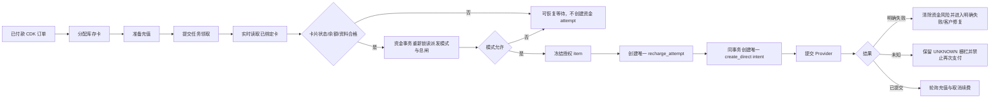

# 阶段三：正常订单自动履约验收记录

> 状态：代码、隔离 MySQL、独立对抗式复核和生产安全部署已完成；真实成功充值尚未执行。
>
> 本文只记录已经由代码、测试或数据库验证的事实，不把设计目标写成已完成事实。

## 本阶段交付边界

阶段三把“每单人工许可后充值”改为两种明确模式：

| 模式 | 正常行为 | 仍然生效的门禁 |
| --- | --- | --- |
| `AUTOMATIC` | 满足条件的正常订单可由 Worker 自动进入充值资金路径 | 全局派发、进程级 Provider 读写、Provider 账户写标记、订单状态、准备任务、卡片实时核验、资金栅栏 |
| `MANUAL` | 只有有效的 `SINGLE` 或 `BATCH` 灰度许可才能进入充值资金路径 | 与自动模式相同，且资金事务内再次验证人工许可 |

`accept_new_orders` 只控制是否接受新订单；停止接单不停止已有外部订单轮询。`dispatch_new_recharges` 是新充值派发总闸，关闭后资金事务不能开始。

## 已实现并验证的链路



已经验证：

1. 正常自动模式无需运营人员逐单点击 Permit。
2. 自动授权、授权 item、`recharge_attempt`、订单 `SUBMITTING` 和 `provider_calls/create_direct/STARTED` 在同一数据库事务内落盘。
3. 每个资金 attempt 最多存在一个 `create_direct` intent；数据库唯一索引会拒绝第二条。
4. 同一订单已有 `ACTIVE`、`UNKNOWN` 或 `SETTLED` 资金风险时，不能创建第二次资金 attempt。
5. `UNKNOWN` 不会自动重付。
6. `MANUAL` 模式只能消费 `SINGLE/BATCH` 许可；许可缺失或过期时不能自动补建 `AUTOMATIC` 许可。
7. 资金事务会重新锁读 `dispatch_new_recharges` 和 `recharge_dispatch_mode`；任务领取后的开关变化不能绕过总闸。
8. 提交前必须有完成的 `PREPARE_RECHARGE`，并立即从 HNSKJ 只读刷新绑定卡；卡片不合格时不创建资金 attempt。
9. 配置型阻塞会退还本次任务尝试次数，不会因为运营开关关闭而耗尽并直接进入 `DEAD`。
10. 周期卡片同步在同一时间桶重复调度时保持幂等；已经完成的相同 dedupe job 不会再次触发唯一键崩溃。
11. 后台已将 Permit 文案限定为灰度工具，并展示当前派发模式，不再把正常履约描述成“逐单确认”。

## Migration 026 验收

Migration：`v1/migrations/026_automatic_fulfillment_funds_fence.sql`

已执行以下隔离 MySQL 8.4 验证：

| 验证 | 结果 |
| --- | --- |
| Migration 001–026 从空库执行 | 通过 |
| Migration 026 在已执行数据库重放 | 通过；列、索引、setting 均保持单份 |
| 025 数据库存在明确失败的历史孤立 `create_direct` | 026 只为满足证据条件的记录补建 `REJECTED/CLEARED` attempt 并完成关联 |
| 025 数据库存在同一 attempt 的两条 `create_direct` | 026 在任何 Stage 3 mutation 前失败；setting 和 generated column 均未创建 |
| generated column | `provider_calls.recharge_create_attempt_id` 存在 |
| 唯一索引 | `uq_provider_calls_recharge_create_attempt` 存在且唯一 |

历史补齐只允许同时满足：调用已结束、`DEFINITE_FAILURE`、订单已失败、没有外部 Provider 订单号。成功、未知、未结束或已有外部订单号的调用不会被自动补齐。

## Readiness 变化

只读 readiness 现在会阻断以下 Stage 3 异常：

- Migration 低于 026；
- generated column 或唯一索引缺失；
- `recharge_dispatch_mode` 缺失或不是 `AUTOMATIC|MANUAL`；
- `create_direct` 没有关联资金 attempt；
- 已有提交 intent 的 attempt 没有 `create_direct`；
- 同一 attempt 存在多条 `create_direct`；
- 其他既有资金风险、未知 Provider 调用、过期租约或人工复核 blocker。

## 测试证据

当前共享工作树在干净隔离数据库执行 Migration 001–027 后：

```text
342 tests
342 passed
0 skipped
0 failed
```

其中 027 与 Browser 控制面属于并行开发内容；上述数字证明当前共享工作树没有回归，但不代表 Browser 真实充值已验收。阶段三额外完成了自动模式并发、人工模式防绕过、事务总闸、资金唯一索引、卡片实时核验、配置等待和卡同步幂等测试。

精确生产提交 `8a3134dcbd8dc227822177ef8b805e5d879025db` 在同一隔离 MySQL 上为 `330 passed / 0 failed / 0 skipped`；生产 release 无数据库测试运行时为 `303 passed / 0 failed / 27 skipped`，27 项均为显式需要 `TEST_DATABASE_URL` 的 MySQL 集成测试。

## 对抗式审查纠正项

首次独立审查确认了四类 P1：人工模式可能被自动授权绕过、readiness 未强制 026、生产历史孤立调用会阻塞 readiness、非法派发模式可能表现为心跳正常但不工作。

当前代码已分别通过以下方式关闭：

- 在资金事务内重新锁读总闸和模式；
- `MANUAL` 禁止自动创建许可；
- readiness 直接检查 026 schema artifacts 和模式合法性；
- 026 对唯一一类“明确无资金副作用”的历史调用做证据约束补齐，其余情况继续 fail closed。

部署前仍需基于最终提交再次执行独立复核；本段不提前把部署后复核写成已完成。

## 尚未完成或尚未验证

1. 尚未在生产启用 `dispatch_new_recharges` 或 Provider 充值写开关。
2. 尚未用免费目标账号完成一笔真实成功充值。
3. 尚未真实验证支付成功、取消自动续费确认、最终 `RECHARGE_SUCCESS` 的整条生产链路。
4. 尚未执行 3–5 单灰度，更未验证每天 100–300 单目标容量。
5. Browser 自动充值只共享资金栅栏设计；不属于本阶段真实充值验收。

## 生产安全部署证据

- 精确 release：`/opt/pojia/releases/20260822-stage3-8a3134d`；`/opt/pojia/current` 已原子切换；源码提交为 `8a3134dcbd8dc227822177ef8b805e5d879025db`。
- release 内持久保存 `.manifest.sha256`；服务器端对 305 个清单文件自行校验通过，独立终审另对 304 个 Git tracked 文件与提交逐项核验，全部一致。
- 发布前创建加密数据库备份，服务器 SHA-256、解密流和 gzip 完整性验证通过；服务器外副本位于 `/Users/lemon/backups/AI充值业务/production/2026-08-22/`，两端 SHA-256 一致。
- Migration 026 首次执行和重放均通过；生产历史中唯一符合条件的 40030 明确失败孤立调用已补齐为 `REJECTED/CLEARED` attempt。
- 迁移后：orphan create call、API attempt 无 create intent、duplicate create intent、活动/未知资金风险、活动充值许可均为 0；generated column 与唯一索引各 1。
- 生产保持 `accept_new_orders=false`、`dispatch_new_recharges=false`、`recharge_dispatch_mode=AUTOMATIC`；Provider 账户写标记全部为 0；Worker 的卡写、充值写和总写进程开关均为 `false`。
- Web、Worker、Bark 均为 active；公网 live/ready 为 200，后台未登录 API 为 401；只读 readiness 为 `ok=true`、无 blocker。
- 原来因周期 dedupe key 冲突而失败的卡片只读同步已修复；新版连续运行成功，相同时间桶重复调度返回 0 而不抛错。
- 部署后资金写 operation 数量为 0，未创建补卡任务；本次没有开卡、卡充值、直充、退款、余额提取或 Browser 支付。
- 部署后独立只读终审结论：P0=0、P1=0。可以表述为“阶段三已安全部署”，但不能表述为“真实成功充值链路已验收”。

## 生产发布和回滚约束

发布时必须：

1. 先做生产数据库加密备份并保存服务器外副本与 SHA-256；
2. 先只读确认重复 create intent、活动/未知资金风险和未结人工许可；
3. 从精确 Git 提交构建 release，不从脏工作树直接复制；
4. 执行并重放 Migration 026；
5. 保持接单、派发、Provider 账户写标记和进程级 Provider 写开关全部关闭；
6. 验证 Web、Worker、Bark、周期卡同步、live、ready 和资金账一致性；
7. 不在本阶段部署动作中执行开卡、卡充值、直充、退款或 Browser 支付。

Migration 026 新增唯一索引并可能补齐一条满足严格条件的历史账本，回滚不能简单删除账本。应用回滚可切换回上一 release；数据库回滚应优先使用发布前备份，并保留发布后的审计数据副本。
