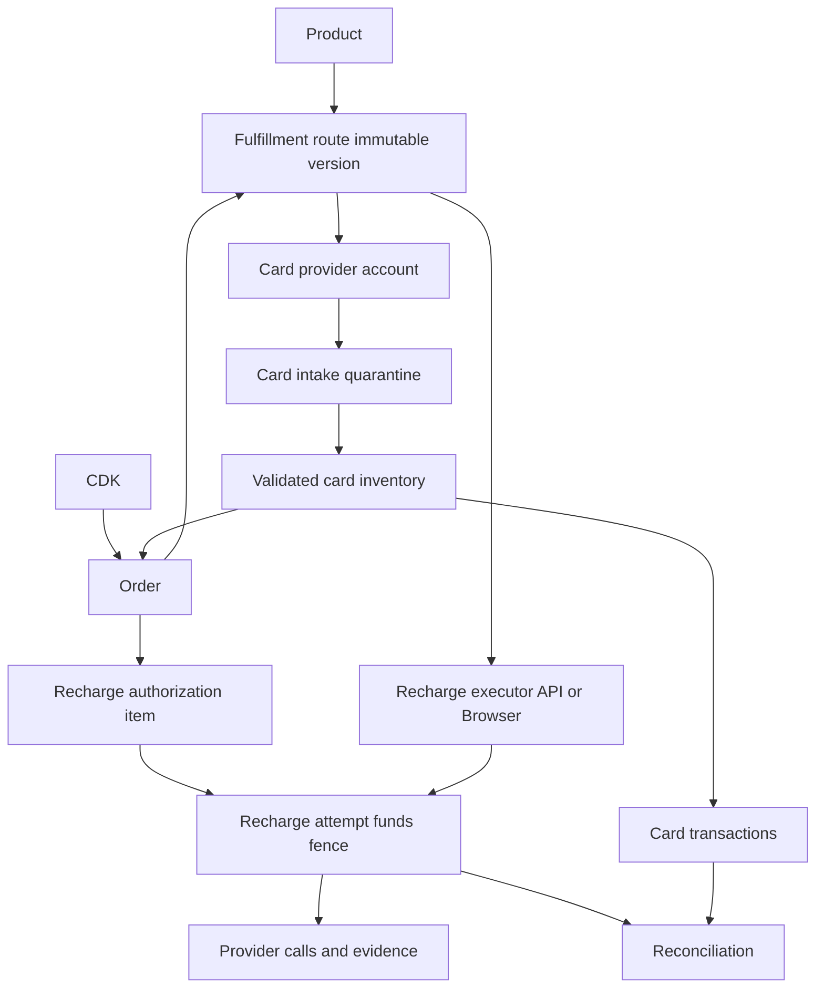

# Foundation v2 架构基线

> 状态：冻结候选，实施依据。任何改变资金、不变量、数据归属或本轮范围的修改，必须先登记到 `docs/DECISIONS.md`。

## 目标

在不引入微服务、Redis、Kafka、完整会计或多租户的前提下，让现有 Plus 系统具备以下基础：

- 每天 100–300 单的可持续处理能力；
- 卡供应商、充值 API 供应商可替换；
- 下一轮可新增浏览器充值执行器；
- 手动开卡后系统能够隔离、校验并自动接管；
- 资金副作用在未知结果时绝不自动重试或切换路线；
- 历史数据能够证据化迁移和持续追账。

## 不可改变的不变量

1. MySQL 是业务状态唯一事实源；运行时不依赖 AI、进程内队列或人工卡锁。
2. CDK 只能成功兑换一次；失败订单不把已兑换 CDK 退回可用状态。
3. 一张卡同一时间最多绑定一个订单；一笔订单默认只使用一张专属卡。
4. 外部资金调用前，必须在同一数据库事务中持久化提交意图和消费明确授权。
5. 一个订单最多存在一次具有资金风险的活动充值尝试。
6. `SUBMIT_UNKNOWN` 只能查询、核对或人工处理；禁止自动重试、换供应商或改走浏览器。
7. 新发现卡必须先进入隔离接管状态，未经验证不得进入可分配库存。
8. 客户 Session、CVV、API Key 不进入普通日志、CSV 或日常后台页面。
9. 浏览器充值必须使用每单隔离的 BrowserContext；禁止跨客户复用 Cookie、Session、缓存和下载目录。
10. 新供应商接入只能实现既定接口，不得静默改变上述业务规则。

## 领域结构



## 最小数据模型

| 模型 | 作用 | 关键约束 |
| --- | --- | --- |
| `provider_accounts` | 区分供应商、账户、环境和用途 | 凭证只保存引用；读写状态分离 |
| `products` | 产品目录 | 本轮只有 `chatgpt_plus` |
| `fulfillment_routes` | 不可变履约路线版本 | 冻结产品、卡账户、充值账户和执行器类型 |
| `recharge_attempts` | 充值业务事实与资金栅栏 | 每单仅一个资金风险活动尝试 |
| `recharge_authorizations` | 单笔/批量确认头 | 有效期、操作人、模式 |
| `recharge_authorization_items` | 冻结被确认订单集合 | 成员不可自动增加；每项消费一次 |
| `card_intake_batches` | 手动开卡后的接管批次 | 记录基线、水位和统计 |
| `card_discoveries` | 新卡发现、隔离和验证 | 未通过验证不得分配 |
| `cards` 扩展 | 卡供应商账户和同步调度 | 唯一键为账户＋外部卡 ID |
| `provider_balance_snapshots` | 追加式账户余额历史 | 不覆盖历史、不虚构流水 |
| `cdk_delivery_events` | CDK 发放事件 | 不保存客户敏感明文 |
| `reconciliation_cases` | 持久化异常及处置状态 | 正常结果可实时计算 |

PAN HMAC仅用于重复风险提示，不作为自动拒绝或跨账户强制唯一键。

## 供应商边界

`provider_accounts` 必须表达：

- `provider_code`：供应商实现代码；
- `account_code`：同一供应商下的账户；
- `environment`：`PRODUCTION` 或 `SANDBOX`；
- `purpose`：`CARD`、`RECHARGE` 或 `BOTH`；
- `credential_ref`：环境变量或密钥文件引用，不保存密钥；
- `read_enabled`、`write_enabled`；
- 账户级请求预算和熔断状态。

旧供应商切换为只读后继续承担历史查询，新订单只能选择 `accepts_new_orders=true` 的不可变路线版本。

## 手动开卡接管

```text
库存低提醒 → 操作员在卡台开卡 → 同步新卡 → QUARANTINED
→ 读取详情与二次一致性验证 → AVAILABLE / PROVISIONING / REVIEW_REQUIRED / FAILED
```

- 专用账户下唯一新增、规则匹配且两次读取一致的卡可以自动接管。
- 共享账户或归属不明时集中批量确认。
- 单卡异常不得阻塞其他已验证卡。
- 卡分配前强制刷新状态、余额和凭据新鲜度。

## 充值授权与资金栅栏

三个控制面必须独立：

1. 是否接收新订单；
2. 是否准备订单和分配卡；
3. 哪些明确订单允许产生资金提交。

批量授权在创建时冻结 `recharge_authorization_items`，后续新订单不得自动加入。提交意图、授权消费和 `recharge_attempts` 活动状态必须原子写入。

API 与未来 Browser 执行器统一实现：

```text
prepare(order) → submit(attempt) → reconcile(attempt)
```

执行器返回统一状态：`PREPARED`、`SUBMITTING`、`PROCESSING`、`SUCCESS`、`FAILED`、`SUBMIT_UNKNOWN`、`HUMAN_REQUIRED`。

## 分层同步

每张卡保存 `sync_tier`、`next_sync_at`、`consecutive_failures`、`last_successful_sync_at` 和 `refund_watch_until`。

| 层级 | 默认策略 |
| --- | --- |
| 新发现/开卡处理中 | 30–60 秒 |
| 可用库存 | 列表 5 分钟；详情 6 小时和分配前 |
| 已分配未充值 | 5–10 分钟 |
| 充值处理中 | 1–5 分钟，最高业务优先级 |
| 刚成功/失败 | 立即、1 小时、24 小时 |
| 退款观察 | 每天；期限可配置 |
| 老终态卡 | 每周或手动 |

账户级调度必须遵守 `Retry-After`，指数退避带随机抖动。资金结果查询优先于历史卡同步。手动刷新也必须去重并受同一预算约束。

## 本轮边界

### 必须实现

- 供应商账户、产品、不可变路线；
- 充值尝试资金栅栏；
- 单笔/批量授权且不依赖全局派发开关；
- 新卡隔离、校验、批量接管；
- 分层同步、账户预算、积压指标；
- CDK 发放、余额历史、异常对账、CSV 导出；
- 历史证据化回填、兼容读和双写。

### 只预留

- Browser 执行器注册点和独立 Worker 边界；
- 新供应商适配器注册点；
- 自动授权和自动补卡策略接口。

### 明确延期

- 真实浏览器付款；
- 新供应商真实接入和切换；
- 自动供应商故障切换；
- 未知结果自动重试；
- 自动退款与余额提取；
- 多租户、微服务、完整会计、Redis、Kafka。

## 发布顺序

1. 兼容结构：新增表和 nullable 字段，旧逻辑继续运行。
2. 双写影子：新旧模型同步记录，完成历史回填和差异报告。
3. 行为切换：无在途充值时切换卡分配、授权和充值尝试主链。
4. 逐级放量：1 单、5 单、20 单。
5. 延后清理：稳定一个完整运营周期后再删除旧字段和任务 JSON Permit。

