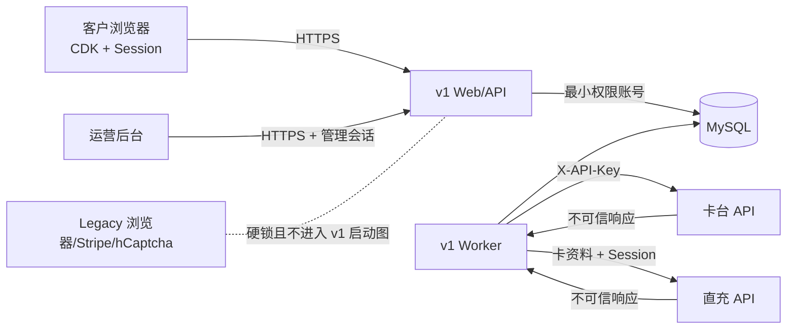

# 破甲 v1：真实 MySQL 接入前安全审查

- 审查日期：2026-08-17
- 范围：`v1/` Web/API、后台认证、客户入口、数据访问、Provider 调用、worker、配置与 legacy 隔离
- 不在范围：真实供应商写调用、真实卡片、真实客户 Session、生产服务器与生产 MySQL 实例

## 结论

当前没有确认到 Critical 或 High 级的直接可利用漏洞。未登录后台读取、会话伪造、SQL 注入、后台存储型 XSS、前端泄露 Session/完整卡资料以及 legacy 误启动均未复现。

真实客户数据的 MySQL 接入暂缓，先处理两个接入阻塞项：

1. Provider 错误消息必须在写入 `tasks.last_error_message` 前统一脱敏。
2. 生产数据库接入必须明确私网或 TLS、应用最小权限账号、独立迁移账号和备份加密方案。

本地一次性测试库不受此结论阻塞；仍应在修复后重跑九个 MySQL 集成用例。生产数据库接入后还需进行第二轮数据库与部署专项审查。

## 信任边界

外部 Provider 响应必须按不可信输入处理。当前主要缺口正位于“Provider 响应 → worker 错误 → MySQL”这条路径。

## 发现

### F-01 中：Provider 错误消息可能未经脱敏写入任务表（接入阻塞）

**已观察事实**

- `extractBusinessError()` 接受外部响应的 `message`，只截断长度，不做字段脱敏：`v1/src/providers/http-client.js:120`。
- Provider 把该消息拼进异常文本；`runOneTask()` 再把 `error.message` 传给任务仓库：`v1/src/workers/task-runner.js:17`、`v1/src/workers/task-runner.js:63`。
- `tasks.last_error_message` 会持久化该文本，后台读取服务也会查询此字段：`v1/migrations/001_initial.sql:97`、`v1/src/services/admin-read-service.js:158`。
- `provider_calls.response_summary_json` 已有递归脱敏，但任务错误路径没有复用它。

**风险推断**

如果直充上游在错误消息中回显请求片段，完整 Session、卡号或 CVV 可能以明文进入任务表。当前没有真实响应证明上游一定会回显，因此这是条件性泄露路径，不把它写成已经发生的数据泄露。

**修复要求**

- 建立单一 `sanitizeOperationalError()` 边界；任务表、事件、通知和日志只接收脱敏后的错误代码与有限摘要。
- Provider 原始错误不得直接作为持久化文本。
- 加入包含 `accessToken`、`sessionToken`、PAN、CVV 和 API Key 的恶意错误 fixture，断言任务记录及后台 API 均不含原值。

### F-02 中：生产数据库的传输与最小权限尚未形成可执行合同（接入阻塞）

**已观察事实**

- 连接池只接收一个 `DATABASE_URL`，代码未要求 TLS，也未区分运行账号与迁移账号：`v1/src/db/pool.js:3`、`v1/scripts/migrate.js:7`。
- 当前没有 v1 生产部署文件；`DEPLOY.md` 明确仍是 legacy 文档，不能作为 v1 上线方案：`DEPLOY.md:1`。
- 数据库保存客户邮箱、账号 ID、加密 Session、订单、资金与退款记录。即使 Session 已使用 AES-256-GCM，加密密钥仍由应用环境持有。

**风险推断**

若直接把远程 MySQL URL 填入环境变量，可能出现明文链路、数据库端口暴露公网、应用账号拥有 DDL/全库权限，或备份未加密等高影响部署错误。当前尚未部署，所以这是已确认的安全设计缺口，不是已发生的入侵。

**接入要求**

- MySQL 只监听私网/本机，禁止公网开放 3306；跨主机连接必须验证 TLS 证书。
- 应用账号仅授予目标 schema 所需的 `SELECT/INSERT/UPDATE/DELETE`；迁移使用短时独立账号，迁移后撤销。
- 数据库凭据、Session 加密密钥和管理会话密钥由部署密钥存储注入，不写入镜像、Git、启动参数或普通日志。
- 备份加密，并实际做一次恢复演练；密钥丢失与轮换要有操作方案。

### F-03 中：内存限流与代理配置不足以直接用于公开生产

**已观察事实**

- 限流状态保存在进程内 `Map`，过期客户端不会被主动清理：`v1/src/app/fixed-window-rate-limit.js:6`。
- 限流键依赖 `req.ip`；`TRUST_PROXY=true` 时服务固定信任一跳代理：`v1/src/server.js:31`。
- 动态验证确认单进程限流有效，但它不会跨进程共享，进程重启后计数清零。

**风险推断**

代理拓扑配置错误时，攻击者可能伪造来源 IP 绕过登录/CDK 限流，或所有客户共享同一代理 IP 而互相误伤。高基数来源还会让 `Map` 长期增长。该问题不阻塞本地测试库，但阻塞公开上线。

**修复要求**

- 第一版单实例可使用有容量上限和定时清理的限流器；上线前至少覆盖登录、下单和状态查询。
- 反向代理必须是应用端口的唯一入口，并使用精确代理网段/跳数配置，不能只靠一个不解释拓扑的布尔开关。
- 多实例时改用共享限流存储，并对管理登录增加全局失败预算。

### F-04 低：`card_key` 被不必要地重复持久化

**已观察事实**

- `recharge_card_key` 已保存在订单表，状态轮询需要它。
- 提交成功事件又把同一值写入 `metadata_json`：`v1/src/db/repositories/workflow-repository.js:169`。
- 状态查询 Provider 调用还把它作为 `provider_calls.request_key`：`v1/src/workers/workflow-handlers.js:98`。

**影响**

这不会从当前后台 API 直接泄露，但会扩大数据库查询、导出和备份中的敏感凭据副本数量。

**修复要求**

事件只记录外部订单号和不可逆指纹/后缀；Provider 调用使用本地稳定请求标识或 `card_key` 的 HMAC 指纹，不保存原值。

### F-05 低：管理员会话在 12 小时内无法单独撤销

**已观察事实**

- 管理会话是 12 小时有效的无状态 HMAC Token：`v1/src/security/admin-session.js:9`。
- 登出只清除浏览器 Cookie；已复制的 Token 在过期或全局更换会话密钥前仍有效。

**当前判断**

v1 是单管理员、只读后台，且 Cookie 有 `HttpOnly`、生产 `Secure`、`SameSite=Strict`，因此当前为低风险。后台加入资金、退款或设置写操作前，应缩短空闲有效期并增加服务端会话版本或可撤销记录。

## 已验证的安全基线

- 后台页面和全部后台读 API 未登录时返回跳转或 `401`；篡改 Cookie、编码路径和错误 HTTP 方法未绕过认证。
- 管理密码使用 scrypt；生产 Cookie 包含 `HttpOnly`、`Secure`、`SameSite=Strict`。
- Helmet 安全响应头和 CSP 已启用；后台恶意 HTML fixture 未生成攻击节点、未执行脚本。
- 当前 SQL 值均通过参数传递；动态状态和分页参数有允许列表/数值边界，未发现用户输入拼入 SQL 结构。
- 客户 Session 在进入仓库前用 AES-256-GCM 加密；CDK 只保存 SHA-256 哈希。
- 后台查询不选择 `session_ciphertext`、完整 PAN、CVV、API Key 或 `recharge_card_key`。
- v1 源码图不导入 legacy 浏览器、Stripe 或 hCaptcha；legacy 服务在连接数据库前要求显式解锁。
- `v1` 生产依赖审计为 0 个已知漏洞，`npm outdated` 无待更新项。
- 当前仓库与历史扫描只命中测试 fixture，没有发现真实 API Key 或私钥；本地管理凭据文件被 Git 忽略且权限为 `0600`，本次审查未读取其内容。

## 验证结果与限制

- `v1`：78 个测试，69 通过，9 个 MySQL 集成测试因本轮未提供测试库而跳过。
- 全仓：legacy 8/8 通过，v1 结果同上。
- 动态 HTTP：后台认证、Cookie 篡改、限流、非法 JSON、路径与方法负向检查通过。
- 动态 XSS：使用本机 Chrome 注入恶意订单、事件、卡片和状态字符串，脚本执行标记为 0，攻击节点为 0。
- 本轮没有连接真实 MySQL、没有调用供应商、没有读取真实管理密码或 API Key，因此无法对生产网络、MySQL 权限、TLS、备份和真实供应商回显行为给出“已验证安全”的结论。

## 接入顺序

1. 修复 F-01 与 F-04，并增加回归测试。
2. 将限流器改为有界清理版本，写清反向代理拓扑。
3. 建立 v1 生产部署合同：HTTPS、应用端口隔离、MySQL 私网/TLS、应用/迁移账号分离、密钥注入和备份。
4. 接入空的测试 MySQL，执行迁移和全部九个集成测试。
5. 对真实 schema 做权限核验、TLS 核验、备份恢复和敏感字段抽样检查。
6. 以上通过后才接入真实客户数据；供应商写调用仍按原有单次审批与单笔 PoC 门槛执行。

